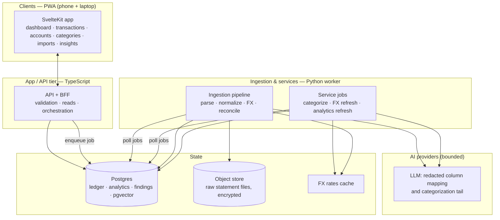
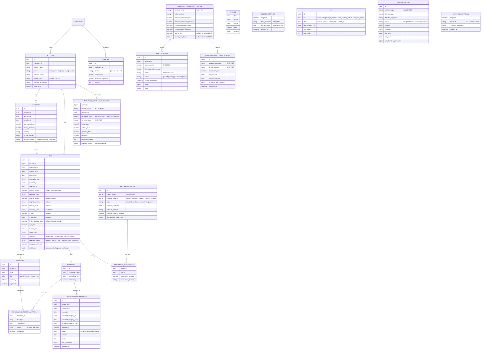
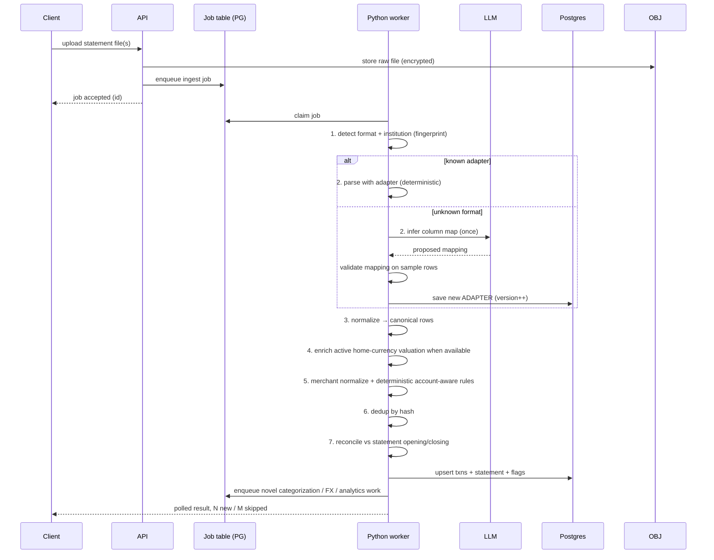
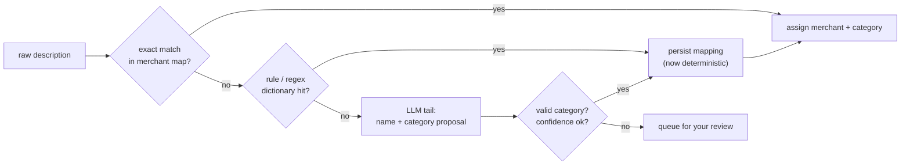
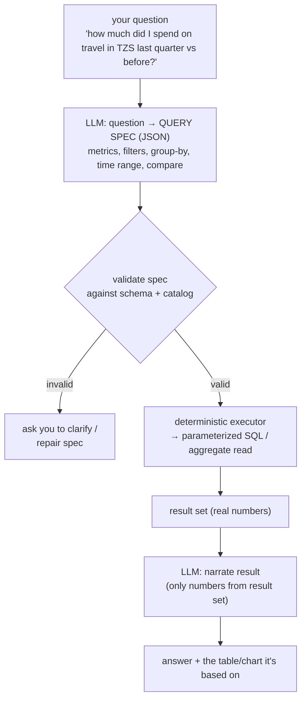

# Ledger — Architecture & System Design

> Long-term target: a self-hostable, multi-institution, multi-currency personal
> finance analytics app that normalizes supported statements into one canonical
> ledger, computes money deterministically, and later adds a grounded
> natural-language layer.

**Status:** Phase 1 completed on 2026-07-24. ADR-0007 remediation and the
expanded gates pass, so Phase 2 is `in_review`. ADR-0008's CAD/TZS home-currency
implementation is present as a separately gated, unapproved Phase 2.1. A named
USD institution adapter is deferred under ADR-0006.
**Audience:** the person building it (you).
**Author's stance:** every tech choice below is argued, not defaulted. Where I
picked a non-obvious tool, there's an ADR explaining what I rejected and why.

---

## 1. Goals & non-goals

### Goals
- **Own your data.** One canonical ledger across every account you have, regardless of bank or currency.
- **Deploy it.** Runs as a hosted web app, installable on phone and laptop (PWA). Not tied to any chat or notebook.
- **Analyze deeply.** Cash flow, trends, seasonality, recurring detection, anomalies, discrepancies, FX exposure, reconciliation, forecasts — not just subscriptions.
- **Ask it things.** Natural-language questions answered from *computed* numbers, with every figure traceable to a query, not a hallucination.
- **Right-sized AI.** AI only where language/ambiguity live. Never in the math.
- **Extensible ingestion.** Adding a new bank or format is config + one AI-assisted mapping pass, not a code rewrite.

### Non-goals (v1)
- Not a budgeting-envelope app, not a bill-pay tool, not a bank aggregator with live API links (Plaid-style) — that's a possible v3, but statement ingestion is the trust-minimizing, bank-agnostic starting point.
- Not multi-tenant SaaS at launch. Phase 2 remains a single-user, single-ledger local
  application; authentication, tenant ownership, billing, and organizations are
  later concerns.
- No tax filing, no investment portfolio pricing (v2+).

---

## 2. Design principles

These are load-bearing. Every later decision derives from them.

1. **Money is computed, never generated.** LLMs never do arithmetic or produce a figure that reaches a balance, total, or chart. All financial values come from deterministic code over the canonical ledger.
2. **AI proposes, deterministic code disposes.** AI output is always a *proposal* (a category, a column mapping, a query spec) that is validated by code before it has any effect. Invalid proposals are rejected, not trusted.
3. **Grounded answers only.** The NL layer answers strictly from tool results (executed queries). If a number isn't in a tool result, it doesn't appear in the answer. No free-text finance.
4. **Run AI once, then cache and learn.** The expensive AI passes (format mapping, categorizing a new merchant) happen once per *novel* input, then the learned result is persisted and reused deterministically forever.
5. **Model tiering by task.** Cheap model for high-volume small jobs; capable model for genuinely hard extraction/planning. (Table in §10.)
6. **Every transaction is idempotent and auditable.** Re-uploading the same or overlapping statement never double-counts. Every derived value can be traced to source rows.
7. **Money has three layers.** Optional original purchase money and required
   account-posted money are immutable evidence. Home-currency reporting is a nullable,
   recomputable lens and never replaces either source layer.

### Notable non-default choices (called out because you asked)
- **Polars, not pandas**, for the analytics/ingestion worker — lazy execution, faster on statement-sized data, cleaner API, and it forces explicit schemas (good for financial correctness).
- **SvelteKit, not Next/React**, as the primary frontend recommendation — smallest runtime for a mobile PWA, one framework for UI + server routes, less ceremony for a solo builder. React/Next is the documented fallback if ecosystem size matters more to you.
- **A constrained query DSL, not text-to-SQL**, for the NL layer — the LLM emits a validated JSON query spec, never raw SQL. Safety + correctness.
- **Postgres-backed job queue for MVP, not Redis/Celery** — one less piece of infra until volume justifies it.
- **uPlot for the dense time-series, ECharts for everything else** — not Recharts. uPlot renders tens of thousands of points on a phone without jank; ECharts covers the richer exploratory charts with one dependency.

---

## 3. System architecture (Phase 2 implementation)



**Component responsibilities**

| Component | Language | Responsibility |
|---|---|---|
| **Client (PWA)** | SvelteKit/TS | Focused ledger routes plus Insights, charts, bounded offline dashboard reads, and responsive installability. |
| **API / BFF** | Node/TS | Request validation, encrypted uploads, parameterized reads, exact-decimal contracts, review writes, and job orchestration. |
| **Python worker** | Python | Parse, normalize, deduplicate, reconcile, enrich FX, categorize the unknown tail, and atomically materialize deterministic analytics. |
| **Postgres** | — | Source of truth for the ledger, learned mappings, FX rates, jobs, analytics snapshots, findings, and review state. |
| **Object store** | — | Application-encrypted raw uploads through the S3 API; MinIO in the local stack. |

**Why this split (polyglot on purpose):** the two hard problems are (1) turning
supported bank PDF/CSV/XLSX/OFX exports into clean rows and (2) statistical
analytics. Python owns both — `pdfplumber` for PDF access and tables, bounded
local Tesseract for the named I&M Tanzania image layout, `polars` for tabular
processing, and exact `Decimal`/standard-library statistics for the current
trend and anomaly work. Everything
user-facing and orchestration-shaped is TypeScript so the client and API share
one type system. This is a deliberate trade: one extra runtime in exchange for
the right tool on each side. Phase 2 adds the deterministic analytics engine;
the grounded ask service described in §9 remains Phase 3 design.

---

## 4. Canonical data model

The whole point: no matter which bank or currency a statement comes from, it
lands in **one** shape. Everything downstream reads canonical rows only.



**Design notes**

- **Sign convention is fixed at ingestion**, per account kind. Credit-card charges are `+`, payments/credits `-`; for a chequing account you may invert. The `direction` enum carries the semantic meaning so analytics never has to guess from sign alone.
- **`amount_native` is bank-posted truth.** It is immutable and drives account
  reconciliation. Optional original money is separate evidence; nullable
  `amount_base` / `fx_rate` values are derived home-currency reporting data.
- **Original amount/currency are paired.** Both are null or both are present,
  and their sign matches the posted transaction flow.
- **Explicit FX fees are not duplicated.** An inline
  `fx_fee_amount_native` is already part of the posted amount; `is_fx_fee`
  identifies a standalone reconciling row.
- **`dedup_hash`** = hash of `(account_id, booked_date, amount_native, currency_native, normalized_description, external_ref)`. This is what makes re-uploads and overlapping statements safe.
- **OFX FITID** is also authoritative within an account: migration `009`
  uniquely constrains `(account_id, external_ref)` only for OFX-enriched rows.
- **`enrichment` JSONB** holds format-specific flags and confidence that do not
  belong in first-class financial columns. Migration `012` backfills valid Amex
  `foreign_spend` evidence into original amount/currency fields and removes the
  duplicate JSON representation.
- **`account_ref_masked`** — migration `011` permits only a non-digit masked
  label plus the final 2–6 digits (for example, `••••71001`). Full or formatted
  account/card numbers fail both request and database validation. (Security,
  §13.)
- **`credit_limit`** is optional, positive, card-only, and denominated in the
  account's native currency. It is utilization metadata, never an asset.
- **Category provenance** makes user choices durable and prevents a later AI
  job from overwriting a transaction-specific correction.
- **Category kind becomes structural once used.** Migration `010` prevents
  changing `kind` after a category is referenced by a transaction, mapping, or
  proposal, or after it has children; unused leaf categories remain editable.
- **pgvector on `MERCHANT.embedding`** remains available for a later semantic
  matcher; the current product uses exact learned merchant-and-flow mappings.
- **Analytics are versioned derived state.** Monthly aggregates, recurring
  links, and findings reference an atomically published run; durable user
  corrections and review states are carried forward across recomputation.

---

## 5. Ingestion pipeline

The extensibility engine. Adding "a different bank with a different currency" is
the main thing this must make cheap.



### Format detection & adapters
- **Detection**: file extension → structural fingerprint (header row signature for CSV/XLSX; extractable or local-OCR text layout signature for PDF). A learned fingerprint maps to an `ADAPTER` row. No deterministic match → unknown path.
- **Adapter** = a saved `column_map` + detection fingerprint per `(institution, format)`. Deterministic once it exists.
- **Parsers by format:**
  - **CSV/XLSX** → conventional CSV and XLSX tables use the same
    deterministic alias-based parser. It scans for one unambiguous header row
    with date, description, and amount or debit/credit columns; the Amex XLSX
    export retains its dedicated adapter.
  - **I&M Tanzania TZS PDF v1** → local Tesseract reads the supplied stable
    image-only layout under page, pixel, and timeout limits. Deterministic code
    cross-checks amount magnitudes against consecutive running balances,
    printed totals, and the closing balance before returning rows. It is a
    named adapter, not a general OCR fallback.
  - **Other PDF** → deterministic `pdfplumber` table extraction. An irregular
    or rejected table reports `needs_ai`; Phase 2 never sends PDF content to a
    provider. General vision/OCR fallback remains later work.
  - **OFX/QFX** → deterministic OFX1 SGML and OFX2 XML bank/card parsing.
    Investment statements are unsupported. FITID is required and unique within
    an account's OFX-enriched transactions; statement currency and masked
    account identity must match the selected account.

### AI-assisted column mapping (runs once per new format)
When an unknown CSV/XLSX arrives, send **only header names + at most five
structurally redacted sample rows** (not the whole file) to the LLM with a
strict output schema: map each source
column to a canonical field (`booked_date`, posted amount/currency,
original amount/currency, inline FX fee, standalone FX-fee evidence,
`description`, `external_ref`, …) plus detected date format,
decimal/thousands separators, and sign convention. Deterministic code validates
paired original fields, column existence, amount versus debit/credit
exclusivity, account/currency/sign compatibility, every parsed row, and
reconciliation. Only a valid mapping is persisted as an `ADAPTER`; invalid
output writes no financial rows and returns `needs_ai`. Every future matching
file is then deterministic and provider-free.

### Compatibility learning and canonical-schema evolution

The learning layer adapts source statements to Ledger; it does not let a model
silently mutate Ledger's financial schema. A new statement follows this
compatibility ladder:

1. **Known structure:** a fingerprint matches a saved adapter. Parse locally
   with no provider call.
2. **New layout, known concepts:** the file contains the canonical concepts
   Ledger already understands, but uses different headers, ordering, date
   notation, decimal notation, or debit/credit representation. AI may propose
   the column correspondence; local code derives financial semantics, parses
   every row, verifies account and currency compatibility, and reconciles the
   statement before versioning and caching the adapter.
3. **Ambiguous or invalid layout:** required evidence is missing, multiple
   interpretations remain plausible, or reconciliation fails. Write no
   statement or transaction rows, preserve the encrypted source, and return
   `needs_ai` with a reason suitable for a mapping-review surface.
4. **New financial concept:** the statement contains information the canonical
   model cannot represent without loss (for example, multiple balances with
   distinct meanings, installment-plan state, or a new account/product type).
   AI may produce a structured compatibility report, but it may not add a
   column, migration, account kind, or arithmetic rule. Schema evolution
   requires an ADR, migration, deterministic parser/normalizer changes,
   sanitized fixtures, reconciliation tests, and an adapter version bump before
   the retained source is replayed.

The persisted learning unit is an adapter identified by institution, file
format, structural fingerprint, account kind, and native currency. Transaction
values and descriptions are not part of the fingerprint. A changed bank export
therefore creates a new adapter version instead of weakening a known mapping.
Adapters must remain inspectable, reversible, and auditable: record the
fingerprint, mapping, version, validation outcome, creation source, and
supersession relationship.

The current implementation covers known structures and validated learned
CSV/XLSX layouts and fails closed to `needs_ai`. Both deterministic and learned
tabular mappings accept paired original-money columns, inline FX fees, and
explicit standalone FX-fee evidence. A user-facing mapping
editor/approval flow, compatibility
reports for genuinely new concepts, adapter rollback/supersession controls, and
safe replay after schema evolution belong to Phase 4 ingestion hardening.

### Idempotency, dedup, reconciliation
- **Upsert on `dedup_hash`.** New hash → insert. Seen hash → skip (report as "already recorded").
- **OFX identity:** the statement FITID is stored as `external_ref`; an OFX-only
  partial unique index enforces `(account_id, FITID)` independently of the
  generic content hash.
- **Reconciliation** (a first-class discrepancy check): for each statement, assert `opening_balance + Σ amount_native == closing_balance`. Mismatch → flag `reconcile_status = mismatch` and surface it (missing rows, OCR error, or a genuine bank discrepancy). Overlapping statements with a **gap** in coverage → `gap`, so trends never silently interpolate over missing months.
- **One posted currency:** the statement currency and every normalized posted
  row must match the selected account. A mixed-currency statement fails
  validation and requires separate accounts rather than implicit conversion.
- **Position anchors:** non-null source-reported balances with status `ok`,
  `gap`, or `pending` may establish a position. `pending` represents one-sided
  evidence (for example, OFX with only a closing balance) that cannot satisfy a
  two-sided arithmetic reconciliation; it is not labeled `ok`. A `mismatch`
  balance is rejected as an anchor.
- **Post-persistence isolation:** categorization, FX-refresh, and analytics
  enqueueing happen after financial persistence. Missing reporting valuation or a
  secondary queue/provider failure cannot roll back a successfully reconciled
  native import.

---

## 6. Multi-currency & FX

- **Store three monetary layers:** optional original purchase money, required
  account-posted/native money, and nullable derived home-currency reporting money with
  the reference rate/date used.
- **Accounts are single-currency:** TZS and USD balances at one bank become
  separate accounts. Statement currency and every posted row must match the
  selected account.
- **Rate source:** Frankfurter v2, whose public API can also be self-hosted and
  covers CAD, USD, and TZS. Accept booked date or a recorded nearest-prior date
  no more than seven days old. Never fall forward or silently accept an older
  rate.
- **One staleness policy:** both worker provider/cache code and web account,
  transaction, net-worth, and FX reads use the validated
  `FX_MAX_STALENESS_DAYS` configuration. Startup rejects values outside `0..7`.
- **Native acceptance is independent of reporting-rate availability:** a missing eligible
  rate leaves reporting fields null and `valuationStatus = pending_fx`, queues
  retryable refresh work, and makes consolidated analytics explicitly partial.
  A later refresh changes derived reporting fields only.
- **Market and home currency are independent.** Account `market_code` (`CA` or
  `TZ`) drives the All/Canada/Tanzania data lens; nullable `market_profile` only
  supplies first-visit and new-account defaults. Neither changes reporting.
- **Home reporting is stable and explicitly maintained.** Stage 1 remains CAD.
  Phase 2.1 supports only CAD and TZS through a confirmed Advanced action. The
  worker takes the ledger advisory lock, rewrites reporting values exclusively
  from immutable native amounts, unpublishes incompatible analytics, and queues
  target-rate recovery plus a full matching-currency generation. Each successful
  switch writes immutable rate/date and threshold-policy evidence. BASE-valued
  recurring identities are transformed in place so review status, cadence, and
  converted overrides survive; incompatible base-valued findings are resolved
  and regenerated.
- **FX analytics separate evidence:** explicit inline and standalone fees are
  actual costs. Bank-applied and reference rates produce a signed estimated
  markup only when evidence permits it; a known inline fee is removed from the
  conversion portion to avoid double counting. A standalone fee is never
  attached to another transaction without source evidence.

---

## 7. Merchant normalization & categorization

A hybrid pipeline that gets cheaper and more accurate the more you use it.



- **Taxonomy** is hierarchical and **user-editable**; your overrides are permanent and always win.
- **The LLM only sees the unknown tail** — opaque request keys, normalized
  merchant text, a coarse flow type, and the current taxonomy. It receives no
  amounts, dates, account/transaction IDs, balances, or statement content.
- **Confidence + review queue:** validated existing categories at or above the
  configured threshold apply automatically. Low-confidence guesses and all new
  category proposals wait for review. You confirm once; it learns.
- **Override precedence:** transaction-specific user choice → user merchant/flow
  mapping → learned AI mapping → deterministic account-aware rule → `Other`.
- **Review surfaces:** the API exposes distinct unresolved merchant/flow pairs
  separately from low-confidence/new-category proposals, so the Categories page
  can show both the remaining workload and audited decisions.

---

## 8. Analytics

The completed Phase 1 baseline computes four read views directly and
deterministically over the canonical ledger:

- **Balance:** native/base position series with opening balances converted and
  credit-card liabilities negated for consolidation. Non-null `ok`, `gap`, and
  one-sided `pending` reported balances may anchor positions; `mismatch` cannot.
- **Cash flow:** account-kind-aware inflow, outflow, and net with transfers and
  card payments excluded from double counting. Card payments remain visible as
  a separate neutral series so imported payment activity is auditable without
  being mislabeled as income or expense.
- **Net worth:** current assets, liabilities, and net worth from imported asset
  and credit-card accounts. Missing verified balances or usable current rates
  are excluded with reasons and make the response `partial`.
- **FX:** foreign-spend evidence compared with the applicable cached market rate
  when both inputs exist.

Account reads also compute exact per-card and aggregate utilization. Transaction
reads return native and base values plus a running balance calculated for each
ordered transaction row, not one shared end-of-day value.

Phase 2 materializes deeper analytics in atomically published snapshots. An
`analytics_refresh` job runs after successful ingestion, category/proposal or
transaction corrections, and FX backfills. Incremental mode finds source months
updated after the prior published watermark, recalculates every dimension for
those months, and copies unaffected monthly aggregates from the previous
generation. Recurring series and findings are recalculated from full source
history independently within `ALL`, `CA`, and `TZ` in both modes because
cadence, duplicate, and anomaly evidence can cross month boundaries. Full mode
recalculates all aggregate periods plus those scoped detectors. Jobs are
deduplicated, publish one matching-currency generation atomically, and record
the source watermark, affected-period list, counts, duration, and errors.

**Trends and seasonality** use a 12-month default with 3-, 6-, 24-month, and
all-history ranges. Monthly inflow, outflow, net cash flow, and spending can be
grouped by account, category, or merchant and compared month-over-month,
year-over-year, or against trailing three-month average/median baselines.
Seasonality requires at least 12 months. Unvalued rows are excluded from reporting
totals, counted by native currency, and make coverage `partial`.

**Recurring detection** excludes transfers and card payments from spending and
uses deterministic cadence windows: weekly 5–9 days, biweekly 12–16, monthly
25–35, quarterly 80–100, and annual 330–400. A series needs three occurrences,
except annual candidates may use two. Comparison prefers consistent original
currency, then account-native currency, then fully valued reporting money. Expected-next
date and overdue are recurrence metadata, not forecasting. User confirmation,
cadence/amount corrections, cancellation, and ignore state survive refreshes.

**Findings** cover unusual transaction amounts/frequency, monthly category or
merchant spikes, near-duplicates, recurring price increases/overdue activity,
reconciliation mismatch, coverage gaps, and pending reporting valuation. Every
finding stores evidence, severity, first/last-seen dates, a stable detector
fingerprint, and durable `new`, `confirmed`, `dismissed`, or `resolved` state.

Balanced amount/spike sensitivity uses modified z-score `>= 3.5` and at least
five prior comparable observations. The seeded CAD `materiality-v1` profile
uses low/balanced/high floors of CAD `25.00`/`10.00`/`5.00` and a CAD `1.00`
price-increase floor. The first TZS switch converts those values with a dated,
non-stale rate and freezes the exact rounded TZS profile for reuse. An
interquartile-range rule handles zero MAD.
Near-duplicates require distinct identities with the same account, merchant,
posted currency, and absolute posted amount within three days and exclude
refunds, reversals, transfers, and payments. Default recurring price-change
materiality is at least 5% and the active frozen profile's reporting-money floor.

Analytics materializes each generation for `ALL`, `CA`, and `TZ`. All includes
unassigned accounts; regional scopes include only explicitly assigned accounts,
even when their native currency is foreign to that market. Scope participates
in recurring/finding fingerprints and review identity. Runs and aggregates are
also bound to the active home currency and threshold-policy version. Readers
return `analytics_rebuilding` when no matching generation is published.

Forecasting remains Phase 4. No model computes analytics or sees transaction
history for finding detection.

---

## 9. "Ask it things" — Phase 3 design

This subsystem is not implemented in Phase 2. Its trust rule remains:
**the model
never sees the database and never emits a number.** It translates and narrates;
code computes.



- **Constrained query DSL, not text-to-SQL.** The LLM outputs a typed JSON spec (allowed metrics, dimensions, filters, time grains, comparisons). A validator rejects anything referencing unknown fields or unsafe operations. A query builder turns the spec into parameterized SQL. **No model-authored SQL ever runs.** This kills injection, hallucinated columns, and silent wrong math in one move.
- **Tool-using agent.** The ask service exposes a small, closed tool set: `run_query(spec)`, `get_timeseries(...)`, `list_anomalies(...)`, `describe_schema()`. The agent may only call these. Every figure in the final answer maps to a tool result — and the UI shows that result (table/chart) beside the prose, so answers are auditable.
- **Ambiguity → clarify, not guess.** "Last quarter" with mixed currencies → the spec makes the base-currency and period explicit, or the agent asks.
- **Everything the ask-layer can answer, the dashboard could show** — it's the same executor underneath. The NL bar is a fast path, not a separate truth.

---

## 10. Where AI is used — the "right amount" matrix

The explicit answer to "just the right amount of AI for just the right amount of
things." If a row could be deterministic, it is.

| Task | Deterministic or AI | If AI: model tier | Frequency | Cached / learned |
|---|---|---|---|---|
| Arithmetic, balances, aggregates, FX conversion | **Deterministic** | — | every read | n/a |
| Recurring detection, anomalies, trends (Phase 2) | **Deterministic** | — | on ingest | materialized |
| CSV/XLSX parsing (known format) | **Deterministic** | — | every file | adapter cached |
| I&M Tanzania TZS image-PDF v1 | **Deterministic local OCR + exact checks** | — | every file | versioned adapter |
| **Column mapping (new/unknown format)** | AI | capable (Sonnet-class) | once per new format | **saved as adapter** |
| **PDF extraction (irregular layout only)** | Deferred to Phase 4 | capable, vision | parser fallback | raw file retained |
| Merchant categorization — head (known) | **Deterministic** | — | every txn | rule map |
| **Merchant categorization — unknown tail** | AI | cheap (Haiku-class) | once per new merchant | **persisted as rule** |
| **NL question → query spec (Phase 3)** | AI | capable | per question | prompt-cached |
| **Result narration (Phase 3)** | AI | cheap | per question | — |
| Insight summaries (later phase) | AI | cheap | on demand | — |

**Cost posture:** current recurring AI cost is limited to novel categorization
work; unknown-format mapping runs once per validated fingerprint. Bulk ingestion
of a known bank costs zero AI. Interactive-question cost begins only if the
Phase 3 ask layer is built.

**Data-to-AI boundary (privacy):** the model sees only redacted headers
plus at most five sample rows for a new tabular format, or the minimized
merchant proposal payload described above. Account-like identifiers are masked.
Full statements, raw balances, PDFs, analytics histories, and finding evidence
are not sent in Phase 2.

---

## 11. Phase 2 API surface

REST/JSON with shared TypeScript/Zod contracts and explicitly mirrored Python
Pydantic models where worker results cross the boundary. All money values are
exact decimal strings.

```
GET    /api/health
POST   /api/ingest
GET    /api/jobs
GET    /api/jobs/:id
GET    /api/accounts
POST   /api/accounts
PATCH  /api/accounts/:id
GET    /api/institutions
POST   /api/institutions
PATCH  /api/institutions/:id
GET    /api/transactions
GET    /api/transactions/:id
PATCH  /api/transactions/:id
GET    /api/categories
POST   /api/categories
PATCH  /api/categories/:id
GET    /api/categories/unresolved
GET    /api/categories/proposals
PATCH  /api/categories/proposals/:id
POST   /api/categories/categorize
GET    /api/analytics/:view     balance | cashflow | net-worth | fx
GET    /api/settings
PATCH  /api/settings
POST   /api/settings/base-currency        confirmed CAD/TZS maintenance action
GET    /api/insights/summary
GET    /api/insights/trends
GET    /api/insights/seasonality
GET    /api/insights/recurring
PATCH  /api/insights/recurring/:id
GET    /api/insights/findings
PATCH  /api/insights/findings/:id
GET    /api/insights/settings
PATCH  /api/insights/settings
POST   /api/insights/rebuild
```

Account, transaction, ordinary analytics, FX, and every Insights read accept an
optional `market=CA|TZ`; omission means All. Account and market filters combine
conjunctively. Transaction responses expose nullable `originalAmount`, `originalCurrency`,
`amountBase`, `fxRate`, and `fxRateDate`, plus `fxFeeAmountNative`, `isFxFee`,
and `valuationStatus`. `amountNative`/`currencyNative` retain their posted
account meaning. All money remains exact decimal strings.

Transaction, job, recurring, and finding query schemas validate URL-backed
date, account, category, merchant, type/status, severity, sort, and pagination
parameters as applicable. A future `/api/ask` surface belongs to Phase 3 and is
not part of the Phase 2 server.

---

## 12. Clients

- **SvelteKit PWA** — installable on iOS/Android/desktop from one codebase. The
  shared shell carries All/Canada/Tanzania scope. Desktop keeps direct feature
  links; mobile is Home, Activity, Insights, More.
- **Insights workflow:** `/insights` contains Overview, Trends, Recurring,
  Findings, and FX tabs with filters, calculation evidence, review actions, and
  complete/partial coverage. Home is limited to scoped reporting net worth,
  native account balances, and recent posted activity.
- **Progressive transaction disclosure:** Activity shows one account-posted
  amount plus `FX`, `Converted`, and/or `Pending`. A responsive accessible
  drawer exposes original/posted/reporting money, rates, fees, markup, and both
  balances. Mixed-currency amount sorting is labeled as reporting order.
- **Narrow offline boundary:** shell assets and `/` use the shell cache. Only
  `/api/analytics/balance` and `/api/analytics/cashflow` use a network-first
  private-read cache. Net-worth responses are never service-worker cached.
  Other page navigations, accounts, FX, transactions, categories, imports,
  jobs, and every write are also uncached by the service worker.
- **Charts:** **uPlot** for the running-balance and dense time-series (fast on mobile, tiny); **ECharts** for category/treemap/heatmap/comparison views. Deliberately not a single heavyweight React chart lib.
- **Ask bar (Phase 3):** if built, it should return prose plus its source
  table/chart and a query-inspection affordance; it is not a Phase 2 client
  element.
- **Responsive-first**, keyboard-accessible, respects reduced-motion.

---

## 13. Security & privacy

Financial data — treat it like it matters, even single-user.

- **Authentication boundary:** Phase 2 has no authentication and must be treated
  as a local single-user service. Passkeys/WebAuthn and multi-user authorization
  are later deployment work, not current controls.
- **Encryption:** raw statement files are encrypted in the application before
  object storage. TLS and database/storage-volume encryption are deployment
  requirements outside the local Compose implementation. The application
  encrypts raw files
  with a versioned AES-256-GCM envelope before MinIO sees them, as recorded in
  [ADR-0001](decisions/0001-application-layer-statement-encryption.md). Host and
  storage encryption remain defense in depth.
- **PII minimization:** store only masked account references. Shared request
  validation and migration `011` require a masked label plus a 2–6 digit suffix;
  full/formatted account or card numbers are rejected. Never place references in
  URLs or query strings. Resource UUIDs may appear in API paths.
- **Least-privilege AI:** per §10, the current product sends only minimized
  categorization payloads or redacted tabular samples. PDF content is never
  sent. The named I&M adapter runs Tesseract inside the worker environment;
  general PDF vision or OCR fallback remains later work.
- **Secrets** in a manager (not env files in the repo); rotate provider keys.
- **Tenant isolation:** Phase 2 has no user/tenant table or row-level security.
  Those must be designed together with authentication before multi-user use.
- **Auditability:** every derived number traces to source rows; categorization
  proposals retain provider/model, opaque request identity, validated assignment,
  status, and review timestamp. Column mappings are stored only after validation.

---

## 14. Deployment & infrastructure

**Recommended topology (container-based, self-hostable):**

| Piece | Choice | Why |
|---|---|---|
| Frontend + API | One SvelteKit deployment (Node adapter) | UI + server routes together; simplest for solo |
| Python worker | Separate container | Long-running ingestion/analytics; scales independently |
| Job queue | **Postgres table + worker poll (MVP)** → Redis/queue later | Skip Redis until volume needs it |
| Database | Managed Postgres (Neon/Supabase) or self-hosted PG + pgvector | Source of truth |
| Object storage | Cloudflare R2 / S3, or a local volume when self-hosted | Encrypted raw files |
| Host | **Fly.io / Railway / Render**, or your own VPS via Docker Compose | Runs containers + PG + volumes in one place; self-hostable |

- **Self-host path:** a single `docker-compose` (web, worker, postgres, minio-for-objects) so you can run the whole thing on your own box — consistent with owning your financial data.
- **CI/CD:** build + typecheck + run the reconciliation/analytics test suite (golden-file tests on sample statements) before deploy. **Financial math must have regression tests** — a fixture statement with a known correct closing balance and category totals that CI asserts on every change.
- **Observability:** structured logs, job success/failure metrics, and a per-ingest reconciliation report. Alert on `reconcile_status = mismatch` spikes (parser regressions).

---

## 15. Build roadmap

Sequenced so you always have a working, useful thing.

**Phase 0 — Ledger core (no AI).**
Canonical schema, Amex XLSX + generic CSV adapters, dedup, FX stamping,
running balance, reconciliation, basic dashboard. *This alone replaces the chat
artifact and works across CSV banks.*

**Phase 1 — Multi-bank + multi-currency baseline (completed 2026-07-24).**
OFX/QFX parser, AI column-mapper for unknown formats, base-currency switching,
FX-fee analytics, CAD/USD/TZS accounts, account/limit management, deterministic
net worth, category taxonomy, learned mappings, and user overrides. The client
is split into Dashboard, Transactions, Accounts, Categories, and Imports.

**Phase 2 — Three-layer money + analytics depth (in review).**
Original/posted/reporting provenance, deferred FX, explicit market scopes,
valuation, supplied I&M Tanzania TZS acceptance, materialized trends and
seasonality, recurring/renewal/price-hike detection, anomaly/data-quality
findings, durable review state, and the Insights workflow. A named USD
institution adapter is deferred by ADR-0006.

**Phase 2.1 — Configurable home currency (implementation present; approval
gated).** Stable CAD/TZS reporting rebuilt from immutable native money,
currency-fenced analytics publication, frozen materiality profiles, maintenance
state, and immutable switch evidence under ADR-0008.

**Phase 3 — Ask it things.**
Query DSL + validator + executor, the tool-using agent, narration, the ask-bar
UI with grounded results.

**Phase 4 — Ingestion hardening + polish.**
General PDF extraction (deterministic + governed fallback + local-model option),
forecasts, offline hardening, and deployment polish.

---

## 16. Resolved Phase 2 decisions

1. Keep the Python worker plus SvelteKit web/API split.
2. Keep the self-hosted Docker Compose path and single-user product boundary.
3. Keep TZS, USD, and CAD accounts single-currency and preserve original,
   posted/native, and reporting money as distinct layers.
4. Use Frankfurter v2 for the cached FX feed.
5. Use Anthropic first behind the provider interface, with minimized structured
   inputs and reviewed taxonomy changes per ADR-0003.
6. Keep irregular-PDF AI extraction and local OCR/model work in Phase 4.
7. Move imported-account net worth into Phase 1 per ADR-0004; manual assets and
   debts remain deferred.
8. Keep Stage 1 reporting fixed to CAD; support stable CAD/TZS home reporting
   only through the ADR-0008 maintenance workflow.
9. Materialize analytics deterministically and preserve recurring corrections
   and finding review states across atomic refreshes per ADR-0005.
10. Keep forecasting in Phase 4, natural-language querying in Phase 3, and all
    Phase 2 findings in-app only.
11. Keep one repository/product/engine and model market membership, market
    profile, and home currency as independent concepts per ADR-0007.

---

*Everything here is designed so the boring 95% is deterministic, tested, and
free, and the AI is concentrated in the 5% where language and ambiguity actually
live — reading a new bank's format, naming an unknown merchant, understanding a
question. That's the "right amount."*
