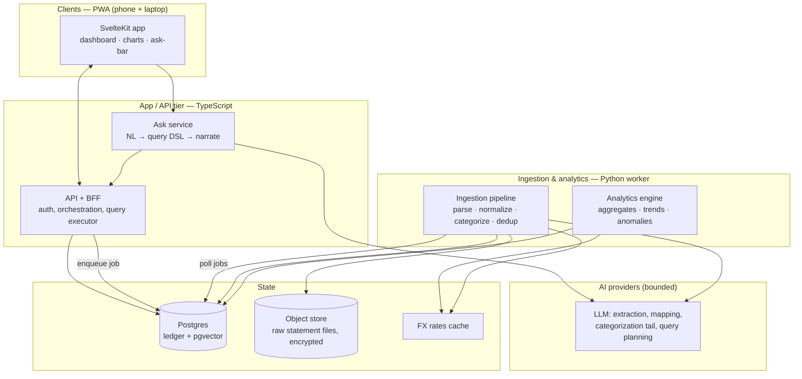
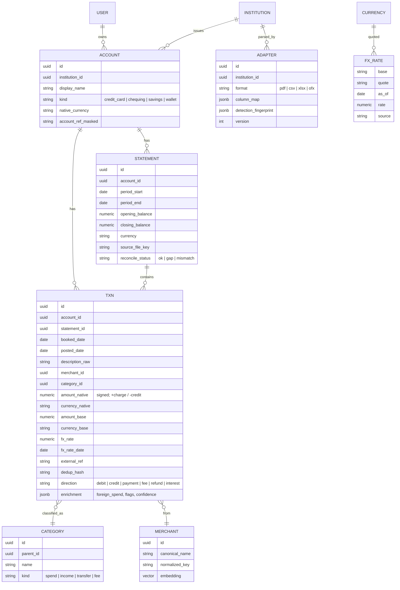
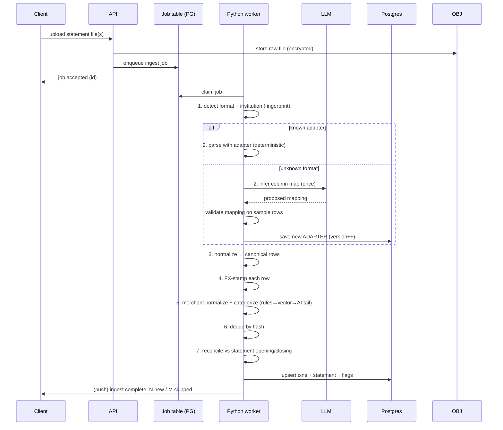
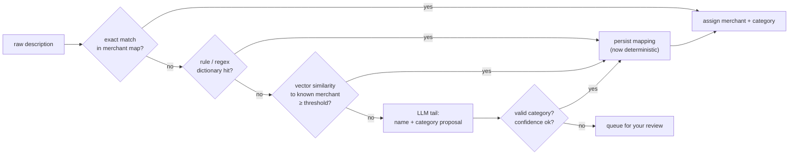
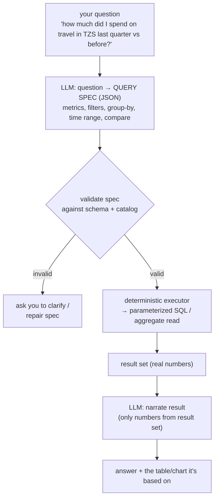

# Ledger — Architecture & System Design

> Working name. A self-hostable, multi-institution, multi-currency personal
> finance analytics app. Ingests statements from any bank in any format,
> normalizes them into one canonical ledger, computes everything
> deterministically, and puts a grounded natural-language layer on top.

**Status:** Phase 0 implemented and in review; later phases remain design scope.
**Audience:** the person building it (you).
**Author's stance:** every tech choice below is argued, not defaulted. Where I
picked a non-obvious tool, there's an ADR explaining what I rejected and why.

---

## 1. Goals & non-goals

### Goals
- **Own your data.** One canonical ledger across every account you have, regardless of bank or currency.
- **Deploy it.** Runs as a hosted web app, installable on phone and laptop (PWA). Not tied to any chat or notebook.
- **Analyze deeply.** Cash flow, trends, seasonality, recurring detection, anomalies, discrepancies, FX exposure, reconciliation, forecasts — not just subscriptions.
- **Ask it things.** Natural-language questions answered from *computed* numbers, with every figure traceable to a query, not a hallucination.
- **Right-sized AI.** AI only where language/ambiguity live. Never in the math.
- **Extensible ingestion.** Adding a new bank or format is config + one AI-assisted mapping pass, not a code rewrite.

### Non-goals (v1)
- Not a budgeting-envelope app, not a bill-pay tool, not a bank aggregator with live API links (Plaid-style) — that's a possible v3, but statement ingestion is the trust-minimizing, bank-agnostic starting point.
- Not multi-tenant SaaS at launch. Single-user / small-trusted-group. The data model is tenant-ready, but we don't build billing, orgs, etc. yet.
- No tax filing, no investment portfolio pricing (v2+).

---

## 2. Design principles

These are load-bearing. Every later decision derives from them.

1. **Money is computed, never generated.** LLMs never do arithmetic or produce a figure that reaches a balance, total, or chart. All financial values come from deterministic code over the canonical ledger.
2. **AI proposes, deterministic code disposes.** AI output is always a *proposal* (a category, a column mapping, a query spec) that is validated by code before it has any effect. Invalid proposals are rejected, not trusted.
3. **Grounded answers only.** The NL layer answers strictly from tool results (executed queries). If a number isn't in a tool result, it doesn't appear in the answer. No free-text finance.
4. **Run AI once, then cache and learn.** The expensive AI passes (format mapping, categorizing a new merchant) happen once per *novel* input, then the learned result is persisted and reused deterministically forever.
5. **Model tiering by task.** Cheap model for high-volume small jobs; capable model for genuinely hard extraction/planning. (Table in §10.)
6. **Every transaction is idempotent and auditable.** Re-uploading the same or overlapping statement never double-counts. Every derived value can be traced to source rows.
7. **The base currency is a lens, not a rewrite.** Original amount + currency are immutable truth. The base-currency view is a derived layer you can recompute or change without touching source data.

### Notable non-default choices (called out because you asked)
- **Polars, not pandas**, for the analytics/ingestion worker — lazy execution, faster on statement-sized data, cleaner API, and it forces explicit schemas (good for financial correctness).
- **SvelteKit, not Next/React**, as the primary frontend recommendation — smallest runtime for a mobile PWA, one framework for UI + server routes, less ceremony for a solo builder. React/Next is the documented fallback if ecosystem size matters more to you.
- **A constrained query DSL, not text-to-SQL**, for the NL layer — the LLM emits a validated JSON query spec, never raw SQL. Safety + correctness.
- **Postgres-backed job queue for MVP, not Redis/Celery** — one less piece of infra until volume justifies it.
- **uPlot for the dense time-series, ECharts for everything else** — not Recharts. uPlot renders tens of thousands of points on a phone without jank; ECharts covers the richer exploratory charts with one dependency.

---

## 3. System architecture (high level)



**Component responsibilities**

| Component | Language | Responsibility |
|---|---|---|
| **Client (PWA)** | SvelteKit/TS | UI, charts, offline read cache, the "ask" bar. Installable on iOS/Android/desktop. |
| **API / BFF** | Node/TS | Auth, request orchestration, the **query executor** (turns a validated query spec into parameterized SQL), serves aggregates. Shares TS types with the client. |
| **Ask service** | Node/TS | Runs the tool-using agent: NL question → query spec (via LLM) → executor → narrated answer. Never touches the DB directly; only via the executor's tools. |
| **Ingestion worker** | Python | The messy, data-heavy work: parse PDF/CSV/XLSX, normalize to canonical schema, categorize, dedup, FX-stamp, reconcile. Best-in-class libraries live here. |
| **Analytics engine** | Python | Deterministic computations and materialized aggregates (trends, anomalies, recurring, forecasts). |
| **Postgres** | — | Source of truth: canonical ledger, categories, learned mappings, FX rates, jobs, embeddings (pgvector). |
| **Object store** | — | Raw uploaded statement files, encrypted at rest (S3/Cloudflare R2 or a local volume when self-hosted). |

**Why this split (polyglot on purpose):** the two hard problems are (1) turning
arbitrary bank PDFs/CSVs into clean rows and (2) statistical analytics. Python
owns both — `pdfplumber`/`camelot` for PDF tables, `polars` for fast columnar
analytics, `statsmodels`/`scikit-learn` for trend and anomaly work. Everything
user-facing and orchestration-shaped is TypeScript so the client and API share
one type system. This is a deliberate trade: one extra runtime in exchange for
the right tool on each side. **Single-runtime fallback** (§16) exists if you'd
rather run all-TypeScript and accept weaker PDF/analytics libraries.

---

## 4. Canonical data model

The whole point: no matter which bank or currency a statement comes from, it
lands in **one** shape. Everything downstream reads canonical rows only.



**Design notes**

- **Sign convention is fixed at ingestion**, per account kind. Credit-card charges are `+`, payments/credits `-`; for a chequing account you may invert. The `direction` enum carries the semantic meaning so analytics never has to guess from sign alone.
- **`amount_native` is immutable truth.** `amount_base` / `fx_rate` are derived and recomputable. Change your base currency → rebuild the base column, source rows untouched.
- **`dedup_hash`** = hash of `(account_id, booked_date, amount_native, currency_native, normalized_description, external_ref)`. This is what makes re-uploads and overlapping statements safe.
- **`enrichment` JSONB** holds format-specific extras (Amex "Foreign Spend Amount", flags like `possible_duplicate`, categorization `confidence`) without schema churn.
- **`account_ref_masked`** — we store only a masked reference (`••••71001`). Full numbers never persist. (Security, §13.)
- **pgvector on `MERCHANT.embedding`** powers "which known merchant is this new string closest to" and semantic transaction search.

---

## 5. Ingestion pipeline

The extensibility engine. Adding "a different bank with a different currency" is
the main thing this must make cheap.



### Format detection & adapters
- **Detection**: file extension → structural fingerprint (header row signature for CSV/XLSX; text layout signature for PDF). A fingerprint maps to an `ADAPTER` row. No fingerprint match → unknown path.
- **Adapter** = a saved `column_map` + detection fingerprint per `(institution, format)`. Deterministic once it exists.
- **Parsers by format:**
  - **CSV/XLSX** → Polars readers. Header row located by scanning for the first row containing date+amount-like columns (your Amex export buries it on row 7 — the detector handles that generically).
  - **PDF** → `pdfplumber`/`camelot` for tabular statements. For irregular layouts, fall through to an **AI extraction pass** (vision/document model) that returns structured rows against a strict schema. This is the one genuinely AI-hard part of ingestion, and it's gated: try deterministic table extraction first, AI only on failure.
  - **OFX/QFX** (many banks export it) → a plain parser; near-zero ambiguity. Support this early — it sidesteps PDF pain entirely for banks that offer it.

### AI-assisted column mapping (runs once per new format)
When an unknown CSV/XLSX arrives, send **only header names + a few sample rows**
(not the whole file) to the LLM with a strict output schema: map each source
column to a canonical field (`booked_date`, `amount`, `currency`, `description`,
`external_ref`, …) plus detected date format, decimal/thousands separators, and
sign convention. Validate the mapping by re-parsing the sample and checking types
and that amounts sum sanely. On pass, persist as a new `ADAPTER`. Every future
file from that bank is then deterministic and free.

### Idempotency, dedup, reconciliation
- **Upsert on `dedup_hash`.** New hash → insert. Seen hash → skip (report as "already recorded").
- **Reconciliation** (a first-class discrepancy check): for each statement, assert `opening_balance + Σ amount_native == closing_balance`. Mismatch → flag `reconcile_status = mismatch` and surface it (missing rows, OCR error, or a genuine bank discrepancy). Overlapping statements with a **gap** in coverage → `gap`, so trends never silently interpolate over missing months.

---

## 6. Multi-currency & FX

- **Store three things per txn:** native amount+currency (truth), the FX rate used, and the base-currency amount (derived). Plus `fx_rate_date` and source.
- **Rate source:** an ECB-backed free API (e.g. Frankfurter) for majors; a broader provider for thin-market currencies. **TZS is thin** — document that rates may only be available at a coarser cadence; fall back to the nearest prior available date and record which date/source was used (never silently guess).
- **Rate is stamped at `booked_date`**, cached in `FX_RATE`. Backfill job pulls missing dates.
- **Base currency is per-user and switchable.** Changing it enqueues a rebuild of `amount_base` across all rows from the immutable native amounts — a pure recompute, no data loss.
- **FX analytics fall out for free:** spend per currency, implied FX fees (compare card's applied rate vs market rate on that date — your Amex rows carry an `Exchange Rate` you can reconcile against), and currency-mix drift over time.

---

## 7. Merchant normalization & categorization

A hybrid pipeline that gets cheaper and more accurate the more you use it.



- **Taxonomy** is hierarchical and **user-editable**; your overrides are permanent and always win.
- **The LLM only sees the unknown tail** — a handful of never-before-seen merchant strings, sent as short text (no amounts, no account data). Its answer is validated against the real taxonomy and then *persisted as a rule*, so the same merchant never costs a second call.
- **Confidence + review queue:** low-confidence guesses are flagged, not silently trusted. You confirm once; it learns.

---

## 8. Analytics engine — the actual analysis

This is the answer to "why are we only looking at subs." All deterministic, all
over the canonical ledger, most materialized as cached aggregates that refresh
when new statements land.

**Cash flow & balances**
- Inflow / outflow / net, per period and rolling.
- Running balance per account and consolidated across accounts (multi-account net position).
- Burn rate and projected period-end balance.

**Spending structure**
- By category / subcategory / merchant / account / currency, with drill-down.
- Share-of-wallet and how it shifts over time.

**Trends & seasonality**
- Month-over-month and year-over-year deltas.
- Moving averages and trend lines; detect rising/falling categories.
- Seasonality once enough history exists (e.g. travel spikes).

**Recurring & subscriptions** (a subset, not the headline)
- Detect recurring charges by cadence + amount stability across periods.
- **Upcoming renewals** and **price-hike detection** (same merchant, amount stepped up).
- **Missing expected charge** (a recurring bill that didn't appear) — itself a discrepancy signal.

**Anomalies & discrepancies** (the part you asked for)
- **Statistical outliers:** a charge far outside a merchant's or category's normal range (robust z-score / MAD).
- **Duplicate charges:** same merchant + amount within a short window.
- **Statement reconciliation mismatches** (§5) and **coverage gaps**.
- **New / churned merchants:** first-ever charge from someone; a regular that stopped.
- **FX fee detection:** card rate vs market rate spread on foreign spend.
- **Refund reconciliation:** did a refund actually land for a disputed charge?

**Forecasting (v2)**
- Simple, explainable projections (recurring + trend), not a black box. Always show the components.

**Materialization:** heavy aggregates live in summary tables keyed by
`(user, grain, dimension, period)`, rebuilt incrementally per account when
ingestion completes. The API and the ask-layer read these, so dashboards and
questions are fast and consistent (same numbers everywhere).

---

## 9. "Ask it things" — grounded NL layer

The trust-critical subsystem. The rule from §2 applies absolutely: **the model
never sees the database and never emits a number.** It translates and narrates;
code computes.



- **Constrained query DSL, not text-to-SQL.** The LLM outputs a typed JSON spec (allowed metrics, dimensions, filters, time grains, comparisons). A validator rejects anything referencing unknown fields or unsafe operations. A query builder turns the spec into parameterized SQL. **No model-authored SQL ever runs.** This kills injection, hallucinated columns, and silent wrong math in one move.
- **Tool-using agent.** The ask service exposes a small, closed tool set: `run_query(spec)`, `get_timeseries(...)`, `list_anomalies(...)`, `describe_schema()`. The agent may only call these. Every figure in the final answer maps to a tool result — and the UI shows that result (table/chart) beside the prose, so answers are auditable.
- **Ambiguity → clarify, not guess.** "Last quarter" with mixed currencies → the spec makes the base-currency and period explicit, or the agent asks.
- **Everything the ask-layer can answer, the dashboard could show** — it's the same executor underneath. The NL bar is a fast path, not a separate truth.

---

## 10. Where AI is used — the "right amount" matrix

The explicit answer to "just the right amount of AI for just the right amount of
things." If a row could be deterministic, it is.

| Task | Deterministic or AI | If AI: model tier | Frequency | Cached / learned |
|---|---|---|---|---|
| Arithmetic, balances, aggregates, FX conversion | **Deterministic** | — | every read | n/a |
| Recurring detection, anomalies, trends | **Deterministic** | — | on ingest | materialized |
| CSV/XLSX parsing (known format) | **Deterministic** | — | every file | adapter cached |
| **Column mapping (new/unknown format)** | AI | capable (Sonnet-class) | once per new format | **saved as adapter** |
| **PDF extraction (irregular layout only)** | AI | capable, vision | only on parser fallback | raw file retained |
| Merchant categorization — head (known) | **Deterministic** | — | every txn | rule map |
| **Merchant categorization — unknown tail** | AI | cheap (Haiku-class) | once per new merchant | **persisted as rule** |
| **NL question → query spec** | AI | capable | per question | prompt-cached |
| **Result narration** | AI | cheap | per question | — |
| Insight summaries ("what changed this month") | AI | cheap | on demand | — |

**Cost posture:** the only *recurring* AI costs are the categorization tail
(tiny, cheap model, shrinks over time as it learns) and interactive questions.
Bulk ingestion of a known bank costs **zero** AI. Prompt-cache the schema/catalog
context for the ask-layer so repeat questions are cheap.

**Data-to-AI boundary (privacy):** the LLM is only ever sent the *minimum* — header names + a few sample rows for mapping; short merchant strings for the tail; the schema + your question for planning; a computed result set for narration. **Account numbers, full statement dumps, and raw balances are not sent** except in the PDF-extraction fallback, which necessarily sends statement content — so that path is opt-in and, for the privacy-strict, swappable for a **local OCR + local model** (§13).

---

## 11. API surface (sketch)

REST/JSON over HTTPS; typed end to end (shared TS types, generated Python models).

```
POST   /ingest              upload files → returns job id
GET    /jobs/:id            ingestion status + reconciliation report
GET    /accounts            list accounts, native currencies, balances
GET    /transactions        filter/paginate/search (params mirror the query DSL)
PATCH  /transactions/:id    user override (category, merchant, split, flag)
GET    /analytics/:view     cashflow | categories | trends | recurring | anomalies | fx
POST   /ask                 { question } → { answer, spec, result, chart }
GET    /categories          taxonomy; PATCH to edit
POST   /settings/base-currency   → enqueues base-amount rebuild
```

The `/transactions` filter params and the `/ask` query spec are **the same DSL**,
so the UI's filters and the NL layer are guaranteed consistent.

---

## 12. Clients

- **SvelteKit PWA** — installable on iOS/Android/desktop from the browser; one codebase. Service worker caches the last-computed aggregates for **offline read** (you can glance at balances on a plane). Writes/ingestion require connectivity.
- **Charts:** **uPlot** for the running-balance and dense time-series (fast on mobile, tiny); **ECharts** for category/treemap/heatmap/comparison views. Deliberately not a single heavyweight React chart lib.
- **The ask-bar** is a first-class UI element, not a chatbot in a corner: type a question, get prose **plus** the table/chart it's grounded in, with a "show the query" affordance.
- **Responsive-first**, keyboard-accessible, respects reduced-motion.

---

## 13. Security & privacy

Financial data — treat it like it matters, even single-user.

- **Auth:** passkeys / WebAuthn primary (no password to leak), with an email fallback. Use a vetted auth library or provider; don't hand-roll crypto.
- **Encryption:** TLS in transit; raw statement files encrypted at rest in object
  storage; DB encrypted at rest. Phase 0 encrypts raw files in the application
  with a versioned AES-256-GCM envelope before MinIO sees them, as recorded in
  [ADR-0001](decisions/0001-application-layer-statement-encryption.md). Host and
  storage encryption remain defense in depth.
- **PII minimization:** store only masked account references; strip full account/card numbers at ingestion. Never put any identifier in a URL or query string.
- **Least-privilege AI:** per the §10 boundary — the model sees the minimum. The PDF-extraction fallback is the only path that sends statement content; make it **opt-in per institution** and offer a **local-model / local-OCR** alternative (e.g. Tesseract + a locally-hosted model) for the privacy-strict, since this app is meant to be self-hostable end to end.
- **Secrets** in a manager (not env files in the repo); rotate provider keys.
- **Tenant isolation** ready via row-level security even though v1 is single-user — cheap to add now, painful to retrofit.
- **Auditability:** every derived number traces to source rows; every AI proposal (mapping, category, spec) is logged with its input and validation result.

---

## 14. Deployment & infrastructure

**Recommended topology (container-based, self-hostable):**

| Piece | Choice | Why |
|---|---|---|
| Frontend + API | One SvelteKit deployment (Node adapter) | UI + server routes together; simplest for solo |
| Python worker | Separate container | Long-running ingestion/analytics; scales independently |
| Job queue | **Postgres table + worker poll (MVP)** → Redis/queue later | Skip Redis until volume needs it |
| Database | Managed Postgres (Neon/Supabase) or self-hosted PG + pgvector | Source of truth |
| Object storage | Cloudflare R2 / S3, or a local volume when self-hosted | Encrypted raw files |
| Host | **Fly.io / Railway / Render**, or your own VPS via Docker Compose | Runs containers + PG + volumes in one place; self-hostable |

- **Self-host path:** a single `docker-compose` (web, worker, postgres, minio-for-objects) so you can run the whole thing on your own box — consistent with owning your financial data.
- **CI/CD:** build + typecheck + run the reconciliation/analytics test suite (golden-file tests on sample statements) before deploy. **Financial math must have regression tests** — a fixture statement with a known correct closing balance and category totals that CI asserts on every change.
- **Observability:** structured logs, job success/failure metrics, and a per-ingest reconciliation report. Alert on `reconcile_status = mismatch` spikes (parser regressions).

---

## 15. Build roadmap

Sequenced so you always have a working, useful thing.

**Phase 0 — Ledger core (no AI).**
Canonical schema, Amex XLSX + generic CSV adapters, dedup, FX stamping,
running balance, reconciliation, basic dashboard. *This alone replaces the chat
artifact and works across CSV banks.*

**Phase 1 — Multi-bank + multi-currency for real.**
OFX/QFX parser, AI column-mapper for unknown formats, base-currency switching,
FX-fee analytics, second-currency accounts. Category taxonomy + rules engine +
user overrides.

**Phase 2 — Analytics depth.**
Trends/seasonality, anomaly + discrepancy suite, recurring/renewal/price-hike
detection, materialized aggregates, multi-account consolidation.

**Phase 3 — Ask it things.**
Query DSL + validator + executor, the tool-using agent, narration, the ask-bar
UI with grounded results.

**Phase 4 — Ingestion hardening + polish.**
PDF extraction (deterministic + AI fallback + local-model option), review queue
for low-confidence categorization, forecasts, PWA offline, self-host compose.

---

## 16. Open decisions (need your call before build)

1. **Runtime split:** polyglot (TS app + Python worker) as recommended, or **all-TypeScript** to cut ops complexity (accepting weaker PDF/analytics libs)? My rec: polyglot — the ingestion/analytics upside is exactly your goal. But it's your ops burden.
2. **Frontend:** SvelteKit (my rec) vs Next/React (bigger ecosystem, you've used React). Both are fine; this is taste + who else might touch the code.
3. **Hosted-managed vs fully self-hosted** from day one? Affects auth provider and object-store choice.
4. **PDF ingestion priority:** if your banks all offer CSV/OFX, we can defer PDF (the hardest AI-dependent part) to Phase 4 and keep AI cost near zero for a long time. Which of your banks are PDF-only?
5. **Base currency:** CAD as base with TZS/USD as native? Or a different base? Drives the FX provider choice (TZS coverage).
6. **AI provider + local-model appetite:** Anthropic API for the AI passes (your existing tooling), and do you want the local-OCR/local-LLM privacy path built in Phase 4, or is cloud extraction acceptable?

---

*Everything here is designed so the boring 95% is deterministic, tested, and
free, and the AI is concentrated in the 5% where language and ambiguity actually
live — reading a new bank's format, naming an unknown merchant, understanding a
question. That's the "right amount."*
