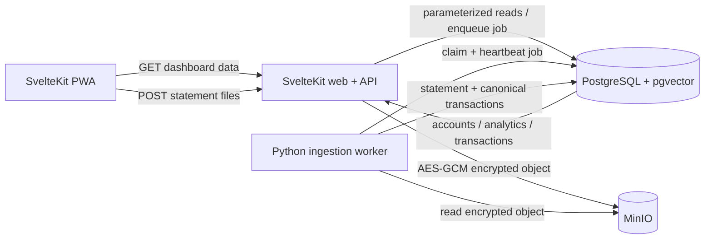

# Ledger Codebase Handoff

- **Snapshot date:** 2026-07-24
- **Current phase:** 0
- **Phase status:** In review
- **Primary source of truth:** [PROJECT_CONTEXT.md](PROJECT_CONTEXT.md)

This guide is the practical map for a developer taking over Ledger. It explains
what runs today, how data moves through the system, which files own each
responsibility, the invariants that must not be weakened, and the safest paths
for extending or debugging the application.

## Read These First

1. [PROJECT_CONTEXT.md](PROJECT_CONTEXT.md) — current phase, accepted scope,
   stack, and explicit non-goals.
2. [BUILD-PLAN.md](BUILD-PLAN.md) — Phase 0 acceptance criteria and what has
   been implemented.
3. [ARCHITECTURE.md](ARCHITECTURE.md) — longer-term design and later-phase
   direction. Some sections describe future behavior, so defer to
   `PROJECT_CONTEXT.md` when the two differ in timing.
4. [ADR-0001](decisions/0001-application-layer-statement-encryption.md) — the
   raw-statement encryption decision and binary envelope.
5. [CHANGELOG.md](../CHANGELOG.md) — implementation changes not yet released.

The current repository has no established Git history. Before transferring
ownership, create and review an initial baseline commit so generated files,
private statements, and local secrets are not accidentally included.

## The System in One Picture



There are two application runtimes:

- The TypeScript/SvelteKit service owns the UI, HTTP API, upload validation,
  encryption, object writes, job creation, and all dashboard reads.
- The Python worker owns file detection and parsing, monetary validation, sign
  normalization, FX stamping, categorization, deduplication, reconciliation,
  job execution, and ledger persistence.

PostgreSQL is the canonical source of truth. MinIO stores encrypted source
objects only. The browser never talks directly to PostgreSQL or MinIO.

## Repository Map

| Path | Responsibility |
|---|---|
| `apps/web/` | SvelteKit PWA, dashboard components, API routes, SQL query builders, upload encryption and storage |
| `packages/shared-types/` | Zod schemas and TypeScript types shared by the browser and server routes |
| `services/worker/worker/` | Python ingestion pipeline, adapters, job runner, PostgreSQL persistence, and deterministic financial logic |
| `services/worker/tests/` | Worker unit, integration, lease, adapter, storage, and reconciliation tests; fixtures must be sanitized |
| `db/migrations/` | Ordered dbmate SQL migrations; this is the executable schema history |
| `db/seeds/` | Idempotent Phase 0 reference data and the local Amex account |
| `scripts/phase0_smoke.py` | Full-stack golden ingestion test using generated, non-private XLSX files |
| `docker-compose.yml` | Local runtime topology, health checks, startup ordering, volumes, and default configuration |
| `Makefile` | Supported developer command interface |
| `.github/workflows/ci.yml` | TypeScript, Python, migration, seed, container, and golden-smoke CI gates |
| `docs/` | Source-of-truth project, architecture, build, decision, and handoff documentation |

Generated directories such as `node_modules/`, `.svelte-kit/`, `build/`, Python
caches, and virtual environments are ignored and are not part of the codebase.

## Runtime Topology and Startup

Docker Compose defines seven containers:

| Service | Lifecycle | Role |
|---|---|---|
| `postgres` | Long-running | PostgreSQL 16 plus pgvector; ledger and job queue |
| `migrate` | One-shot | Applies all dbmate migrations after PostgreSQL is healthy |
| `seed` | One-shot | Loads idempotent reference data after migrations complete |
| `minio` | Long-running | Private S3-compatible object storage |
| `minio-init` | One-shot | Creates the bucket, application user, and bucket-scoped policy |
| `worker` | Long-running | Polls and processes ingestion jobs |
| `web` | Long-running | Serves the PWA and HTTP API |

The web and worker containers do not start until both the database seed and
MinIO initialization complete successfully. Seeing `migrate`, `seed`, and
`minio-init` in an exited state with code 0 is expected.

Persistent state lives in the `postgres_data` and `minio_data` volumes. Normal
`make down` preserves both. `docker compose down --volumes` permanently removes
the local ledger and encrypted source objects.

Default host bindings are loopback-only:

- App: `http://localhost:3000`
- PostgreSQL: `localhost:5432`
- MinIO API: `http://localhost:9000`
- MinIO console: `http://localhost:9001`

## End-to-End Ingestion Flow

1. `UploadPanel.svelte` sends `accountId` and one or more files to
   `POST /api/ingest` as multipart form data.
2. `checkUploads()` enforces file count, individual size, total size, extension,
   and basic file-signature rules. Phase 0 accepts CSV, XLSX, and PDF.
3. The web service verifies the account exists.
4. For each file, the web service computes a SHA-256 digest of the plaintext and
   constructs `statements/{accountId}/{digest}.{extension}`. Original filenames
   are not stored in the object key.
5. The web service encrypts the bytes with AES-256-GCM and writes the object with
   an `If-None-Match: *` precondition. An identical upload reuses the existing
   content-addressed object.
6. The web service inserts an `ingest` job containing `account_id` and the unique
   object keys, then returns HTTP 202 with the job ID.
7. The worker claims the next queued or stale job using `FOR UPDATE SKIP LOCKED`,
   assigns a fresh UUID claim token, and starts a lease heartbeat.
8. For each file, the worker fetches the authoritative account kind, reads and
   authenticates the encrypted envelope, selects the highest-confidence
   deterministic adapter, and parses rows plus statement metadata.
9. The pipeline reconciles the source statement, stamps base-currency values,
   normalizes the merchant, applies deterministic category rules, computes each
   transaction deduplication hash, and persists the statement and rows.
10. The worker records per-file results. Successful files remain committed even
    if a later file fails. Any failed file makes the overall job `failed`; if no
    file fails but at least one deterministic PDF needs a future parser, the job
    becomes `needs_ai`; otherwise it becomes `done`.
11. The browser polls `GET /api/jobs/:id`, then refreshes accounts, analytics,
    and transactions when the job reaches a terminal state.

## Web Application

### UI ownership

| File | Purpose |
|---|---|
| `src/routes/+page.svelte` | Dashboard state and orchestration; loads accounts, categories, analytics, and paginated transactions |
| `src/lib/components/UploadPanel.svelte` | File selection, upload, job polling, and partial-result messaging |
| `src/lib/components/AccountStrip.svelte` | Account summaries and account selection |
| `src/lib/components/TransactionsTable.svelte` | Search, filtering, sorting, pagination, and transaction display |
| `src/lib/charts/BalanceChart.svelte` | uPlot running-balance chart |
| `src/lib/charts/CashflowChart.svelte` | ECharts inflow/outflow/net chart |
| `src/service-worker.ts` | PWA shell caching and network-first caching for account/analytics aggregates |

The service worker deliberately does not cache transaction pages, job results,
uploads, or raw statement data. It caches the shell plus `GET /api/accounts` and
`GET /api/analytics/*` responses for offline aggregate reads.

### HTTP API

| Method and route | Behavior |
|---|---|
| `GET /api/health` | PostgreSQL-backed readiness check |
| `POST /api/ingest` | Validate, encrypt, store, and enqueue statement files |
| `GET /api/jobs/:id` | Return job state and validate/map the Python result contract |
| `GET /api/accounts` | Return account summaries and current balances |
| `GET /api/categories` | Return category reference data |
| `GET /api/transactions` | Validated search/filter/sort/pagination over canonical rows |
| `GET /api/analytics/balance` | Running base-currency balance, optionally by account/date |
| `GET /api/analytics/cashflow` | Monthly inflow, outflow, and net, optionally by account/date |

Transaction query parameters are `accountId`, `categoryId`, `direction`,
`from`, `to`, `search`, `sort`, `page`, and `pageSize`. Analytics supports
`accountId`, `from`, and `to`. Zod rejects unknown or invalid values before SQL
is built. SQL values are parameterized; search wildcards are escaped.

Important balance semantics:

- Account summaries use the latest reported closing balance plus later
  transactions. If no reported closing balance exists, they use the earliest
  opening balance plus all transactions.
- Transaction running balances are calculated over the full account ledger
  before result filters and pagination are applied.
- Date-filtered balance charts also calculate the cumulative balance first and
  filter visible dates afterward.
- Credit-card cash flow treats positive non-payment amounts as outflow and
  negative credits/refunds as inflow. Payments are excluded from spending flow.
- Asset accounts (`chequing`, `savings`, `wallet`) treat positive values as
  inflow and negative values as outflow.

### Server-side helpers

| File | Purpose |
|---|---|
| `src/lib/server/db.ts` | Connection pool and all reusable parameterized SQL/query builders |
| `src/lib/server/upload.ts` | Upload limits, extension checks, and file signatures |
| `src/lib/server/storage.ts` | Content-addressed object keys and conditional MinIO writes |
| `src/lib/server/encryption.ts` | Node implementation of the statement envelope |
| `src/lib/server/job-result.ts` | Strict worker-result validation and snake_case-to-camelCase mapping |
| `src/lib/server/env.ts` | Runtime configuration parsing and safe defaults |
| `src/lib/server/api.ts` | Consistent API errors and private read-cache headers |

### Shared TypeScript contracts

`packages/shared-types/src/` contains the Zod schemas for accounts, analytics,
categories, jobs, query specifications, and transactions. These schemas are the
browser/server contract and should be changed before routes or UI consumers.

Python Pydantic models mirror the relevant contracts manually; they are not
generated from the TypeScript package. When a job/result shape changes, update
both runtimes and their contract tests in the same change.

## Python Worker

### Module ownership

| File | Responsibility |
|---|---|
| `worker/main.py` | Environment parsing, JSON logging, signal handling, and polling loop |
| `worker/pipeline.py` | Adapter selection, canonicalization pipeline, per-file isolation, and job runner |
| `worker/repository.py` | PostgreSQL job leases and canonical-ledger persistence; in-memory test double |
| `worker/models.py` | Pydantic source, parsed, canonical, and result models |
| `worker/money.py` | Exact source-money precision validation |
| `worker/fx.py` | Deterministic base-currency stamping and FX provider protocol |
| `worker/categorize.py` | Merchant normalization and keyword/direction category rules |
| `worker/dedup.py` | Stable canonical transaction identity hash |
| `worker/reconcile.py` | Statement arithmetic and statement-period coverage gaps |
| `worker/storage.py` | S3 reads and authenticated AES-GCM decryption |
| `worker/adapters/base.py` | Adapter protocol plus shared header, amount, date, and metadata parsers |
| `worker/adapters/amex_xlsx.py` | American Express XLSX parser |
| `worker/adapters/generic_csv.py` | Alias-based CSV parser with account-aware sign normalization |
| `worker/adapters/pdf_table.py` | pdfplumber/Camelot table extraction, then generic tabular parsing |
| `worker/llm/` | Disabled-by-default provider seam reserved for a later phase |

### Adapter behavior

`AdapterRegistry` currently registers adapters in code, in this order:
Amex XLSX, generic CSV, and deterministic PDF. The seeded `adapter` database
rows document known mappings but are not dynamically loaded by the worker in
Phase 0.

Detection returns a confidence score; the highest score must meet the registry
threshold. Parsing is fail-closed:

- Multiple accepted aliases for the same field are rejected rather than chosen
  nondeterministically.
- Slash-date order is inferred once from all statement-period, booked, and
  posted values. Unresolved or conflicting MDY/DMY evidence is rejected.
- Source monetary values must be exactly representable at two decimal places.
  The worker never silently rounds source values such as `0.005`.
- Amex rows are valid only for credit-card accounts.
- Generic asset-account CSVs require separate debit/credit columns. A signed
  generic `Amount` column is rejected because its sign convention is ambiguous.
- PDF tables are parsed deterministically through the generic tabular path. A
  readable PDF with no tables, or with a table rejected by the generic parser,
  returns `needs_ai`; Phase 0 does not call an AI service. Opening or extraction
  exceptions can instead make the file unsupported during detection or
  `failed` during processing.

Camelot is tried only when pdfplumber extracts no rows. If pdfplumber returns a
nonempty but unusable table, the adapter returns `needs_ai` without trying
Camelot. A PDF detection exception scores below the registry threshold and is
reported as unsupported instead of `needs_ai`.

### Financial normalization

The authoritative account kind comes from PostgreSQL, not the uploaded file.

- Credit cards: charges/fees are positive; payments/credits/refunds are
  negative.
- Asset accounts: debit/withdrawal is negative; credit/deposit is positive.
- Source native values are immutable truth. Derived base values and rates are
  stored separately.
- CAD-to-CAD uses an identity rate of 1. The production worker has no non-CAD FX
  provider wired in Phase 0, so a foreign-native transaction fails closed.
  Amex foreign-spend text on a CAD statement is retained as enrichment and does
  not change the statement's native currency.

The transaction deduplication hash is SHA-256 over:

`account_id, booked_date, two-decimal native amount, uppercase native currency, normalized description, external reference`

Reconciliation is exact:

`opening_balance + sum(amount_native) = closing_balance`

It produces `ok`, `mismatch`, or `pending` when a required balance is missing.
Account-wide period analysis may change a statement to `gap`. Coverage is
re-evaluated whenever a statement is persisted, so an out-of-order upload can
close an earlier gap.

### Job leases and partial results

Claims use a UUID `claim_token`. Heartbeats update only the matching claimed
row. Completion and failure updates are fenced by both job ID and claim token,
so a stale worker cannot overwrite a job reclaimed by another worker. Claimed
jobs older than `WORKER_JOB_TIMEOUT_SECONDS` are eligible for recovery.

Each file is persisted in its own database transaction. In a multi-file job,
successful files are not rolled back when another file fails. The terminal job
result always preserves each file's status, added/skipped counts, reconciliation
data, and a sanitized failure reason.

Fencing protects job-state writes, not an in-progress ledger transaction. A
worker that loses its lease may finish its current file before noticing, so
statement-source and transaction-hash uniqueness are the final idempotency
barriers. Queued jobs are prioritized ahead of stale claims, which means heavy
continuous queue traffic can delay stale-job recovery.

The current repository has no per-account ingestion lock. Concurrent jobs for
the same account can race while refreshing coverage, and concurrent creation of
the same previously unknown category uses a select-then-insert path. If Phase 0
is moved beyond low-volume single-user operation, harden these paths before
raising worker concurrency.

## Database Model

Five ordered dbmate migrations create nine domain tables:

| Table | Purpose |
|---|---|
| `institution` | Issuing financial institution |
| `account` | Account identity, kind, native currency, and masked reference |
| `statement` | Source period, opening/closing balances, object key, and reconciliation status |
| `txn` | Canonical immutable-native and derived-base transaction row |
| `category` | Hierarchical category reference data |
| `merchant` | Normalized merchant identity; embedding column is dormant in Phase 0 |
| `job` | PostgreSQL-backed ingestion queue and per-job results |
| `adapter` | Known mapping/fingerprint records; dynamic learned adapters are future work |
| `fx_rate` | Dated FX rates; Phase 0 seeds only CAD identity |

Important database guarantees:

- `txn.dedup_hash` is unique across the canonical ledger.
- `(statement.account_id, statement.source_file_key)` is unique for non-null
  source keys.
- Migration 005 repairs pre-existing duplicate statements and repoints their
  transactions before adding the statement uniqueness constraint.
- Monetary values use fixed-precision `numeric` columns.
- Currency codes, account kinds, directions, reconciliation states, job states,
  and JSON object shapes have database checks.
- Job claim tokens are unique while non-null, and stale claims are indexed.
- `updated_at` is maintained by application SQL; there are no timestamp
  triggers.

The seed is transactional and idempotent. It creates one stable CAD Amex credit
card, 15 categories, two adapter records, and the CAD identity FX rate. There is
no account-management UI or API yet; adding another local account currently
requires a seed/migration or direct administrative database change.

Compose runs the seed during normal startup. Its fixed rows use
`ON CONFLICT DO UPDATE`, so direct edits to seed-owned account, category,
adapter, or FX IDs can be overwritten on the next start. Add separate rows with
new IDs, or change the seed intentionally when the seeded defaults should move.

## Security and Privacy Boundaries

Raw statements use this binary envelope in both TypeScript and Python:

`LEDGER01 || 12-byte nonce || 16-byte authentication tag || ciphertext`

`LEDGER01` is also AES-GCM additional authenticated data. The web service writes
the envelope; the worker authenticates and decrypts it. A wrong key or modified
object fails closed.

Operational rules:

- `STATEMENT_ENCRYPTION_KEY` must be the same exact 64-character hexadecimal
  value in web and worker. Losing it makes stored statements unreadable.
- The value committed in `.env.example` is intentionally insecure and for local
  development only.
- Replace database, MinIO root, MinIO application, and encryption credentials
  before any non-local deployment.
- MinIO's application user is bucket-scoped. Do not give web or worker the root
  MinIO credentials.
- Services bind to `127.0.0.1` by default. There is no authentication in Phase
  0; exposing the stack on `0.0.0.0` without an authenticated TLS proxy is
  unsafe.
- `ORIGIN` must match the URL used by the browser. SvelteKit rejects cross-origin
  form posts, which commonly appears as a 403 when a host name or port changes.
- Real `.env` files, raw financial exports, dumps, backups, certificates, and
  private fixture directories are ignored. Only sanitized fixtures may be
  checked in.
- The PWA's offline cache contains account and analytics aggregates. This is
  private financial data even though raw files and transaction pages are not
  cached.

Production backup, TLS, authentication, database dump, key rotation, and secret
management procedures are not implemented by the Phase 0 Compose stack.

## Developer Setup and Commands

To run the container stack:

- Docker with Compose
- Make is optional, but required for the `make` command shortcuts

Host-side builds, checks, tests, and smoke tooling additionally require:

- Node.js 22+
- pnpm 11.x (`packageManager` pins 11.4.0)
- uv with Python 3.12 support

First start:

```sh
cp .env.example .env
docker compose up --build
```

Open `http://localhost:3000`. The seed supplies the initial Amex account.

| Command | What it does |
|---|---|
| `make up` | Build and start the complete stack in the foreground |
| `make down` | Stop the stack and preserve volumes |
| `make logs` | Follow recent service logs |
| `make ps` | Show Compose service state |
| `make migrate` | Apply pending dbmate migrations in Docker |
| `make seed` | Apply migrations, then load idempotent seed data |
| `make build` | Build the pnpm workspace and production web/worker images |
| `make check` | TypeScript checks, Svelte diagnostics, Ruff, and strict mypy |
| `make test` | Vitest suites and pytest suite |
| `make smoke` | Exercise the golden API flow against an already healthy, fresh stack |

`make smoke` generates three sanitized Amex-shaped XLSX files in memory. It
asserts three successful reconciliations, a closing balance of `2855.59`, exact
cash-flow points, six canonical transactions, and zero added rows on an
identical second upload. It expects a fresh database; running it again against
the same persisted golden rows fails its first-import assertion.

## Tests and CI

### TypeScript

- `packages/shared-types/test/` covers query and worker-result contracts.
- `apps/web/src/lib/server/*.test.ts` covers SQL builders, encryption,
  content-addressed storage behavior, and worker-result validation.
- `svelte-check` validates route and component typing.

### Python

- Adapter detection and parsing tests cover headers, signs, dates, ambiguity,
  foreign-spend values, and deterministic PDF behavior.
- Financial primitive tests cover cent precision, FX stamping, deduplication,
  reconciliation, categorization, and coverage gaps.
- Pipeline tests cover the `2855.59` golden result, repeat ingestion, partial
  multi-file failure, out-of-order coverage, and account-kind behavior.
- Lease tests cover stale reclaiming, fencing, and heartbeats.
- Storage tests cover Python envelope decryption, key validation, and tamper
  rejection; the container smoke test exercises the actual Node-encrypts /
  Python-decrypts path.
- `test_postgres_golden.py` is opt-in through `LEDGER_TEST_DATABASE_URL`; the
  container smoke test covers the production PostgreSQL path in CI.

CI runs four jobs:

1. Frozen pnpm install, TypeScript/Svelte checks, and Vitest.
2. Frozen uv sync, Ruff, strict mypy, and pytest.
3. Compose validation plus migrations and seeds applied twice, followed by
   schema assertions.
4. A fresh production container stack and the full golden smoke test. This job
   always destroys its disposable volumes afterward.

Do not weaken the golden closing-balance or repeat-ingestion assertions when
changing financial code.

## Common Change Paths

### Add or change a statement adapter

1. Implement the `Adapter` protocol under `worker/adapters/`.
2. Make detection structural and deterministic.
3. Reuse the shared amount/date/header helpers and fail closed on ambiguity.
4. Register the adapter in `AdapterRegistry`; database `adapter` rows alone do
   not activate code in Phase 0.
5. If adding a new extension, update web upload validation, object-key format
   validation, UI accept filters, and tests.
6. Add sanitized fixtures and tests for detection, sign behavior, date order,
   precision, metadata, foreign values, and repeat ingestion.

### Change an API or result shape

1. Change the Zod schema in `packages/shared-types/` first.
2. Update the SvelteKit route and UI consumer.
3. If the worker participates, update the corresponding Pydantic/result model
   and `job-result.ts` mapping.
4. Add contract tests on both sides before changing persistence.

### Change the schema

1. Add a new ordered dbmate migration; never edit an already-deployed migration
   to represent a new production change.
2. Make the migration safe to apply to existing data and safe to re-run through
   dbmate.
3. Update seeds if reference data changes.
4. Update `PROJECT_CONTEXT.md` and the affected architecture/specification docs.
5. If the design deviates from the documented plan, add an ADR and changelog
   entry before implementation.

### Change financial behavior

Keep native money immutable, use `Decimal`/PostgreSQL `numeric`, preserve
account-kind sign rules, and add a regression at the lowest deterministic layer
plus the full pipeline when balances can change. Never use JavaScript floating
point or an LLM for authoritative arithmetic.

### Add a dashboard query or filter

Define and validate it in `shared-types`, add a parameterized builder in
`db.ts`, expose it through a SvelteKit route, and add SQL-builder tests. Decide
explicitly whether filters apply before or after running totals; the existing
balance and transaction queries intentionally compute full-ledger state first.

## Debugging Guide

### The app does not start

```sh
docker compose ps --all
docker compose logs --tail=200 postgres migrate seed minio minio-init web worker
```

Check one-shot container exit codes first. A migration or MinIO policy failure
prevents web and worker startup by design.

### An upload remains queued or claimed

```sh
docker compose logs --follow worker
docker compose exec postgres psql -U ledger -d ledger \
  -c "select id, status, claimed_at, finished_at, error from job order by created_at desc;"
```

Queued jobs usually indicate a worker/database problem. A claimed job should
heartbeat. Old claims become reclaimable after `WORKER_JOB_TIMEOUT_SECONDS`.

### A job fails with an encryption/storage error

Verify that web and worker share the same `STATEMENT_ENCRYPTION_KEY`, S3
endpoint, bucket, and application credentials. Old objects cannot be decrypted
after changing the key. A stored object must begin with the authenticated
`LEDGER01` envelope, not an XLSX/PDF/CSV plaintext signature.

### A repeat upload adds transactions

Inspect the plaintext content-derived object key, the statement source unique
constraint, and the transaction identity inputs. A changed date, amount,
normalized description, currency, account, or external reference intentionally
changes the deduplication hash.

### A balance is wrong

Check, in order:

1. Account kind and source sign convention.
2. Exact opening/closing balances and statement period.
3. Transaction native amounts before base-currency values.
4. Reconciliation status and reported difference.
5. Coverage gaps or overlapping/out-of-order statements.
6. Query semantics in `db.ts`, especially whether the view uses latest closing
   or earliest opening and whether filters are applied after running totals.

### A multipart POST returns 403

Use the same host and port as `ORIGIN`. For example, an app configured with
`ORIGIN=http://localhost:3000` may reject a form posted with an origin of
`http://127.0.0.1:3000`.

## Known Phase 0 Boundaries

- Single-user local deployment; no authentication or tenant enforcement.
- One seeded account and no account-management API/UI.
- Deterministic XLSX/CSV/PDF ingestion only; no AI fallback is active.
- CAD is the operational base currency; non-CAD native accounts are not wired
  to a production FX provider.
- Category rules are fixed in code; no category override workflow exists.
- Adapter database records are not dynamically executed or learned.
- pgvector and merchant embeddings are provisioned but unused.
- The worker reads/decrypts each source object fully in memory and processes
  files serially. Its health check proves process liveness, not database or
  MinIO reachability; web readiness checks PostgreSQL but not MinIO.
- Source object keys are treated as immutable. Reusing a statement source key
  does not refresh its stored statement metadata, and a duplicate transaction
  remains linked to the statement that inserted it first.
- No live bank connections, subscriptions, anomalies, recurring detection,
  forecasting, or natural-language query layer.
- No production TLS, backup automation, key rotation, metrics, tracing, or
  external secret manager.

Do not implement later-phase features until `PROJECT_CONTEXT.md` advances the
phase or the scope is explicitly overridden.

## Handoff Checklist

- Review `git status` and create a clean baseline commit without `.env`, raw
  statements, generated builds, or local caches.
- Replace all development credentials and the encryption key before deploying
  beyond a local machine.
- Run `make check` and `make test`.
- Run the container smoke test on a fresh disposable stack.
- Import the owner's original three Amex exports and confirm the expected
  `2855.59` closing balance before marking Phase 0 complete.
- Confirm backup and key-recovery procedures before storing irreplaceable data.
- Keep `docs/` canonical and publish it to Confluence only when a Confluence
  space is configured.
