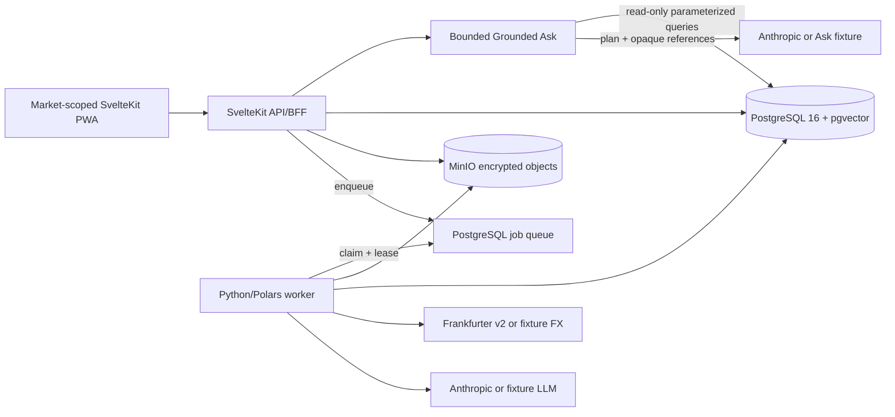

# Ledger Phase 3 — Codebase Handoff

**Snapshot:** 2026-07-25

**Current phase:** Phase 3

**Phase status:** `in_progress`

This handoff starts from completed Phase 2 and the separately approved Phase
2.1 follow-up. Their three-layer ledger, market-scoped analytics, deep Insights,
and CAD/TZS home reporting are the permanent baseline. Phase 3 is building a
bounded read-only Ask workflow in SvelteKit under ADR-0009. It remains
`in_progress`; ADR-0010 adds fail-closed freshness and local-only clarification.
The phase cannot enter review until all deterministic gates and the one-time
live Anthropic acceptance run pass.

## Read These First

1. [PROJECT_CONTEXT.md](PROJECT_CONTEXT.md) — active scope and phase metadata.
2. [PHASE-3-BUILD-PLAN.md](PHASE-3-BUILD-PLAN.md) — active Phase 3 backlog,
   contracts, privacy boundary, and release gates.
3. [PHASE-2-BUILD-PLAN.md](PHASE-2-BUILD-PLAN.md) — completed Phase 2/2.1
   record and permanent acceptance gates.
4. [PHASE-1-BUILD-PLAN.md](PHASE-1-BUILD-PLAN.md) — completed Phase 1 record.
5. [BUILD-PLAN.md](BUILD-PLAN.md) — completed Phase 0 baseline and golden
   reconciliation contract.
6. [ARCHITECTURE.md](ARCHITECTURE.md) — current design plus explicitly labeled
   later-phase design.
7. [ADR-0001](decisions/0001-application-layer-statement-encryption.md),
   [ADR-0002](decisions/0002-accept-equivalent-amex-description-columns.md),
   [ADR-0003](decisions/0003-ai-categorization-proposals.md),
   [ADR-0004](decisions/0004-account-positions-and-net-worth.md),
   [ADR-0005](decisions/0005-three-layer-money-and-materialized-insights.md),
   [ADR-0006](decisions/0006-im-bank-tanzania-pdf-and-deferred-usd-acceptance.md),
   [ADR-0007](decisions/0007-market-scopes-and-progressive-disclosure.md),
   [ADR-0008](decisions/0008-configurable-cad-tzs-home-currency.md),
   [ADR-0009](decisions/0009-bounded-tokenized-grounded-ask.md), and
   [ADR-0010](decisions/0010-fail-closed-ask-freshness-and-local-clarification.md).
8. [CHANGELOG.md](../CHANGELOG.md) — delivered changes by phase.

`docs/` is canonical. Jira and Confluence are not configured for this project;
the local Phase 3 build plan is the active backlog.

## System at a Glance



The SvelteKit process owns UI rendering, validation, HTTP contracts, encrypted
uploads, parameterized ledger/Insights reads, the synchronous Phase 3 Ask
workflow, review writes, and job creation.

The Python worker owns parsing, normalization, FX stamping, deterministic
categorization, reconciliation, provider-backed categorization and column
mapping, recovery base rebuilds, and atomic analytics publication. PostgreSQL
is authoritative for ledger data, settings, cached rates, learned mappings,
review proposals, analytics snapshots/review state, and job state. Ask plans,
evidence, answers, and conversation context are not persisted.

## Repository Map

| Path | Responsibility |
|---|---|
| `apps/web/` | SvelteKit UI, API routes, PWA shell, server SQL, and browser/component tests |
| `packages/shared-types/` | Zod schemas and canonical TypeScript request/response contracts |
| `services/worker/worker/` | Python ingestion, provider integrations, service jobs, and persistence |
| `services/worker/tests/` | Worker regression tests and synthetic fixture policy |
| `db/migrations/` | Ordered schema migrations; `014` adds market scopes and `015` adds CAD/TZS home-currency fencing |
| `db/seeds/` | Idempotent taxonomy and local development account seed |
| `scripts/phase0_smoke.py` | Golden Phase 0 `2855.59` and repeat-import flow |
| `scripts/phase1_smoke.py` | Historical Phase 1 synthetic flow and shared smoke helpers |
| `scripts/phase2_smoke.py` | Historical synthetic three-layer money, FX, scoped analytics, and Insights smoke helpers |
| `scripts/phase2_analytics_benchmark.py` | Disposable 100k full-refresh, warm Insights/Ask-query, and three-query-plan performance gate |
| `scripts/phase3_smoke.py` | Active fresh-stack stub Ask flow plus permanent Phase 0–2.1 regression gates |
| `scripts/ask_live_acceptance.py` | Opt-in privacy-safe live Anthropic canonical/adversarial release gate |
| `docs/` | Source-of-truth scope, architecture, decisions, plans, and handoff |

Generated builds, dependency stores, caches, local environments, raw financial
files, and `.env` are not source artifacts.

## Local Runtime

The Compose stack has four long-running services plus one-shot migration/seed
jobs:

| Service | Role |
|---|---|
| `web` | SvelteKit UI and `/api/*` routes on port `3000` |
| `worker` | Claims and processes PostgreSQL jobs |
| `postgres` | Canonical ledger, settings, FX cache, and queue |
| `minio` | Encrypted raw-statement objects; console on port `9001` |
| `migrate` / `seed` | Apply ordered migrations and idempotent development data |

The normal interactive start is:

```sh
cp .env.example .env
make up
```

Use the stub providers for deterministic integration and smoke work:

```sh
WORKER_PROVIDER_MODE=stub docker compose up --build --detach
curl --fail --silent --show-error http://127.0.0.1:3000/api/health
```

`WORKER_PROVIDER_MODE=live` uses Frankfurter and uses Anthropic only when
`ANTHROPIC_API_KEY` is nonblank. Without that key, deterministic known-format
imports still work, unknown CSV/XLSX files settle as `needs_ai`, and existing
categorization proposals remain reviewable; new categorization jobs cannot run.

Ask has an independent web-process gate. `ASK_ENABLED=false` keeps it disabled
even when worker AI is configured. `ASK_PROVIDER_MODE=live` is the configured
default and reuses the existing Anthropic API key and capable/cheap model
settings; `ASK_PROVIDER_MODE=stub` uses deterministic planning/narration
fixtures. `ASK_PROVIDER_TIMEOUT_MS=20000` bounds each provider call. A missing
key or unusable live provider makes only Ask unavailable. `GET /api/ask/status`
reports that state without exposing secrets or model identifiers.

The singleton `ledger_settings` row stores independent `market_profile` and
`base_currency` values. Market profile supplies defaults only. Home currency is
stable CAD or TZS and changes only through the confirmed Advanced maintenance
path, which rebuilds from native values and temporarily unpublishes Insights.

## Current Application Routes

`apps/web/src/routes/+layout.svelte` owns the persistent brand, desktop and
mobile navigation, privacy indicator, content frame, and footer. The focused
routes are:

| Route | Current responsibility |
|---|---|
| `/` | Scoped reporting net worth, scoped accounts with native balances, and recent posted activity |
| `/transactions` | Scoped URL-backed filters/sort/paging, one posted amount, conversion indicators, responsive audit drawer, and category correction |
| `/accounts` | Scoped asset/card sections, market assignment, account/institution editing, and card limits/utilization |
| `/categories` | Taxonomy editing/archive, unresolved work, proposal review, and categorization retry |
| `/imports` | Account-targeted upload, job polling, history, reconciliation, failure, and `needs_ai` states |
| `/insights` | Ask first/default, then Overview, Trends, Recurring, Findings, and FX, with scoped filters, grounded evidence, and review/correction actions |
| `/settings` | General market profile plus Advanced health, readiness, sensitivity, rebuild, and confirmed CAD/TZS maintenance |
| `/more` | Mobile hub for Accounts, Categories, Imports, and Settings |

The shared shell resolves market by URL, remembered browser preference,
`marketProfile`, then All. Mobile navigation is Home, Activity, Insights, More.

The CSS and components preserve responsive layouts, keyboard use,
reduced-motion behavior, and installable-PWA behavior.

### Service-worker privacy boundary

`apps/web/src/service-worker.ts` caches only:

- build/static shell assets;
- the `/` navigation with a network-first shell fallback; and
- successful network-first reads for `/api/analytics/balance` and
  `/api/analytics/cashflow`.

Direct navigation to all other pages is network-only. Net-worth responses
are never service-worker cached. The worker also does not cache transaction
pages, account lists, FX analytics, jobs or job details, uploads or other
writes, category/proposal data, import history, or Ask status/results. API
handlers also emit
`Cache-Control: no-store` read headers. Treat browser Cache Storage as private financial
data when testing or handing a device to someone else.

## HTTP API

All endpoints are under `/api`. Money and rates cross the boundary as exact
decimal strings. Validation contracts live in `packages/shared-types/src/`.

| Method and path | Contract |
|---|---|
| `GET /api/health` | PostgreSQL readiness |
| `POST /api/ingest` | Validate, encrypt, store, and enqueue one account's files |
| `GET /api/jobs` | Filtered/paginated job history |
| `GET /api/jobs/:id` | Kind-discriminated job state and result |
| `GET /api/accounts` | Optional market-scoped native/reporting positions and utilization |
| `POST /api/accounts` | Create an account with required `marketCode` |
| `PATCH /api/accounts/:id` | Edit metadata/market and queue a full refresh after funded market changes |
| `GET /api/institutions` | List institutions |
| `POST /api/institutions` | Create an institution |
| `PATCH /api/institutions/:id` | Rename an institution |
| `GET /api/transactions` | Optional market-scoped filtering, reporting-value sorting, paging, and compact conversion indicators |
| `GET /api/transactions/:id` | Canonical transaction plus structured original/posted/reporting, rate, fee, markup, and balance evidence |
| `PATCH /api/transactions/:id` | Apply a transaction correction or explicit merchant/flow mapping |
| `GET /api/categories` | Taxonomy including archive/protection metadata |
| `POST /api/categories` | Create a taxonomy entry |
| `PATCH /api/categories/:id` | Rename, move, edit, or archive when allowed |
| `GET /api/categories/unresolved` | Distinct unresolved merchant/flow pairs with counts and date bounds |
| `GET /api/categories/proposals` | Filter the audited categorization review queue |
| `PATCH /api/categories/proposals/:id` | Accept or reject one pending proposal atomically |
| `POST /api/categories/categorize` | Enqueue a deduplicated manual retry/backfill |
| `GET /api/analytics/balance` | Corrected running/consolidated position series |
| `GET /api/analytics/cashflow` | Inflow/outflow/net plus neutral card-payment series, excluding transfer double counting |
| `GET /api/analytics/net-worth` | Current included/excluded account valuation and completeness |
| `GET /api/analytics/fx` | Actual explicit FX fees, bank/reference rates, signed estimated markup, and partial coverage |
| `GET /api/settings` | Active home currency plus nullable market profile |
| `PATCH /api/settings` | Set or clear market profile without changing reporting |
| `POST /api/settings/base-currency` | Queue confirmed CAD/TZS maintenance rebuild |
| `GET /api/insights/summary` | Range totals, MoM/YoY spending, recurring/finding counts, coverage, and latest run |
| `GET /api/insights/trends` | Monthly series, trailing baselines, MoM/YoY comparisons, movers, and partial coverage |
| `GET /api/insights/seasonality` | Month-of-year averages/medians or explicit insufficient history |
| `GET /api/insights/recurring` | Filtered/paginated recurring series and linked occurrences |
| `PATCH /api/insights/recurring/:id` | Confirm/cancel/ignore or override cadence and expected amount |
| `GET /api/insights/findings` | Filtered/paginated durable findings with calculation evidence |
| `PATCH /api/insights/findings/:id` | Confirm, dismiss, or resolve one finding |
| `GET /api/insights/settings` | Analytics sensitivity and update time |
| `PATCH /api/insights/settings` | Change sensitivity and queue a deduplicated full refresh |
| `POST /api/insights/rebuild` | Queue an incremental or full analytics refresh |
| `GET /api/ask/status` | Report independent Ask enablement/availability without secrets or model identifiers |
| `POST /api/ask` | Validate one bounded question/context request and return grounded evidence, clarification, unsupported, or no-data |

The implemented Phase 2 Insights contract exposes summary, trends, seasonality,
recurring, findings, settings, and rebuild endpoints under `/api/insights`,
including `PATCH` review/correction routes for recurring series and findings.
The exact route list and filters are canonical in
[PHASE-2-BUILD-PLAN.md](PHASE-2-BUILD-PLAN.md#public-interfaces). Route presence
and focused tests are not release acceptance by themselves; the integrated and
real-bank gates remain separately recorded.

The Phase 3 Ask contract is separate from URL-filter query schemas. `AskPlanV1`
is a strict execute/clarify/unsupported union; execute contains one to three
aggregate, seasonality, recurring, finding, FX, or transaction-evidence specs.
`POST /api/ask` accepts a 1–500 character question, explicit `ALL|CA|TZ` market,
validated IANA timezone, and no more than three prior question/validated-plan
pairs. A local clarification may add a strict opaque selection and its prior
execute plan without changing the question. Answered responses include
normalized/resolved plans, exact-decimal evidence, display hints, analytics
generation/home currency/threshold policy, source watermark, coverage,
truncation, and freshness state. SQL, prompts, provider payloads, secrets, and
model identifiers never cross the public API.

Transaction payloads retain `amountNative`/`currencyNative` as posted account
truth and add nullable `originalAmount`, `originalCurrency`, `amountBase`,
`fxRate`, and `fxRateDate`, plus `fxFeeAmountNative`, `isFxFee`, and derived
`valuationStatus: "valued" | "pending_fx"`. All money and rate values cross the
API as decimal strings rather than JavaScript numbers.

Omitted `market` means All across accounts, transactions, ordinary analytics,
FX, and Insights. Unassigned accounts exist only in All. When no analytics
generation matches the active home currency, Insights returns the structured
`analytics_rebuilding` maintenance error while accounts and Activity remain usable.

Important server-side files:

| File | Responsibility |
|---|---|
| `apps/web/src/lib/server/db.ts` | Pool, parameterized queries, and canonical account/transaction/Phase 1 analytics read builders |
| `apps/web/src/lib/server/insights.ts` | Materialized Insights reads, filters, review writes, settings, and rebuild enqueueing |
| `apps/web/src/lib/server/ask/` | Phase 3 provider adapters, prompts, date resolution, deterministic executor, tokenization, narration validation, and orchestration |
| `apps/web/src/routes/api/ask/` | Ask status and question HTTP handlers |
| `apps/web/src/lib/server/phase1.ts` | Account mapping and deduplicated service-job enqueueing |
| `apps/web/src/lib/server/upload.ts` | Upload validation, encrypted object writes, and ingest job creation |
| `apps/web/src/lib/server/job-result.ts` | Worker snake_case to public camelCase result validation |
| `apps/web/src/lib/server/api.ts` | Consistent JSON errors and privacy headers |

`packages/shared-types/src/account.ts`, `analytics.ts`, `ask.ts`, `category.ts`,
`insights.ts`, `institution.ts`, `job.ts`, `query-spec.ts`, `settings.ts`, and
`transaction.ts` define the public TypeScript contracts. The Python Pydantic
models mirror the worker side explicitly; they are not generated from
TypeScript.

## Grounded Ask Flow

1. The Insights Ask tab loads `/api/ask/status` independently so disabled or
   unavailable AI cannot break deterministic Insights.
2. `POST /api/ask` validates question length, explicit market, IANA timezone,
   at most three prior questions plus validated plans, and an optional strict
   local entity-selection token.
3. A code-owned gate rejects canonical SQL, write, forecast, advice, balance,
   and net-worth intents before database/provider work. Otherwise one
   capable-model call sees only the question/context, the current local date/home
   currency, and the static DSL catalog. It returns execute, clarify, or
   unsupported; it cannot inspect schema, SQL, entity catalogs, rows, or
   results.
4. Strict validation rejects extra keys and unsupported combinations. Symbolic
   dates and normalized exact entity matches resolve locally. Missing or
   ambiguous entities and account/scope conflicts return focused local
   clarification choices. Database-derived choices use opaque tokens; selecting
   one keeps the original question unchanged and skips the capable planner.
5. Execute plans compile one to three specs through code-owned enum branches.
   Every user/provider value is a bound parameter. One repeatable-read,
   read-only transaction pins all reads to one matching analytics generation
   and home currency. Newer transaction, statement, account, category, or
   merchant state fails closed with `analytics_rebuilding` before any result.
6. The executor preserves exact PostgreSQL numeric values as decimal strings,
   bounds tables to 20 rows and monthly series to 120 points, and emits
   coverage, truncation, watermark, and freshness metadata.
7. Every database-derived value, date, label, identifier, relationship, and
   factual clause becomes an opaque request-local reference. At most one cheap
   narration call may return connective text plus known references.
8. Unknown references, quantitative literals, currency/percentage syntax,
   malformed/refused/truncated output, or timeout triggers deterministic local
   narration without discarding evidence.
9. Only the browser tab retains up to three prior questions and validated
   plans. Reload, reset, market change, or home-currency change clears them.
   The server does not persist or log Ask content.

One request has a 45-second budget, each provider call has a 20-second limit,
and there is no automatic model retry. Each web process accepts at most two
concurrent Ask requests. Cancellation propagates from the browser where the
runtime supports it.

## Ingestion Flow

1. `POST /api/ingest` validates the account and multipart files.
2. The web process encrypts each file with the `LEDGER01` AES-256-GCM envelope
   and stores only ciphertext in MinIO.
3. One `ingest` job references the account and content-addressed object keys.
4. A lease-fenced worker claims the job and decrypts each object in memory.
5. The adapter registry evaluates OFX/QFX, Amex XLSX, conventional generic CSV,
   conventional generic XLSX, the named I&M Tanzania TZS image-PDF layout, and
   deterministic extractable PDF tables.
6. An unsupported CSV/XLSX may enter the AI column-mapping path. Unsupported
   or irregular PDF remains deterministic `needs_ai`; Phase 3 never sends PDF
   content to a model or external OCR service.
7. Parsed rows are normalized with account-kind-aware signs, dated FX rates,
   deterministic categories, merchant identities, and stable dedup hashes.
8. The worker reconciles opening balance plus native movement against closing
   balance, then persists the statement and transactions atomically.
9. After financial persistence succeeds, novel unresolved merchant/flow pairs,
   missing FX work, and a deduplicated incremental analytics refresh can be
   enqueued separately. Adapter-derived metadata enrichment of an existing
   transaction also advances the source watermark without changing posted
   identity. A provider or secondary-job failure cannot roll back the
   reconciled import.
10. The browser polls the job API and refreshes the affected views.

### Supported format behavior

- **Amex XLSX:** recognizes the transaction/summary export and the equivalent
  Description/Merchant aliases governed by ADR-0002.
- **Generic CSV:** deterministic known headers, explicit date/decimal/sign
  handling, paired original amount/currency, inline/standalone FX-fee evidence,
  asset debit/credit semantics, and fail-closed ambiguity.
- **Generic XLSX:** the versioned `generic_xlsx_v1` adapter applies the same
  conventional-table rules to exactly one unambiguous worksheet. It is a
  format adapter, not evidence of compatibility with any named institution.
- **Unknown CSV/XLSX:** sends headers plus at most five structurally redacted
  sample rows to the capable-model mapping provider. It validates the column
  map, date and decimal formats, amount versus debit/credit exclusivity,
  currency, sign convention, parsed row types, account compatibility, and
  reconciliation before storing the adapter fingerprint. Invalid output writes
  no financial rows and remains `needs_ai`.
- **OFX/QFX:** supports OFX1 SGML and OFX2 XML bank/card statements. It requires
  FITID, validates statement currency and masked account identity, and rejects
  investment statements. Migration `009` makes `(account_id, FITID)` unique for
  rows marked with `ofx_transaction_type` enrichment.
- **I&M Tanzania TZS PDF:** `im_bank_tz_pdf_v1` recognizes the supplied stable
  image-only layout and runs bounded local Tesseract OCR. Every amount must
  equal its running-balance delta, printed totals must agree, and the statement
  must reconcile to its printed closing balance. Zero-activity statements are
  accepted only when opening and closing balances agree. A changed layout
  needs a new adapter version.
- **Other PDF:** deterministic extractable-table parsing remains available.
  Missing or rejected tables return `needs_ai`; general or irregular-PDF
  AI/OCR remains outside Phase 3.

## Worker Modules and Providers

| Module | Responsibility |
|---|---|
| `worker/main.py` | Environment validation, live/stub provider wiring, and worker loop |
| `worker/pipeline.py` | Per-file ingestion, post-persistence refresh triggers, and discriminated job runner |
| `worker/repository.py` | PostgreSQL leases, persistence, mappings, proposals, rates, and rebuild operations |
| `worker/storage.py` | S3/MinIO access and `LEDGER01` envelope decryption |
| `worker/models.py` | Canonical Pydantic input/output models |
| `worker/money.py` | Exact decimal normalization and quantization |
| `worker/dedup.py` | Stable transaction hashes |
| `worker/reconcile.py` | Exact native-currency reconciliation and coverage gaps |
| `worker/analytics.py` | Exact-decimal aggregate/detector primitives plus PostgreSQL incremental/full refresh and atomic publication |
| `worker/adapters/generic_xlsx.py` | Deterministic conventional XLSX v1 parser backed by generic tabular rules |
| `worker/adapters/im_bank_tz_pdf.py` | Versioned I&M Tanzania TZS image-PDF adapter with bounded local OCR and exact cross-checks |
| `worker/categorize.py` | Account-kind-aware deterministic rules and flow classification |
| `worker/ai_categorization.py` | Minimized batching, structured validation, thresholding, mapping, and proposals |
| `worker/column_mapping.py` | Redacted unknown-tabular mapping, validation, and learned adapter persistence |
| `worker/fx.py` | Frankfurter/cache/fixture providers, refresh, and atomic base rebuild |
| `worker/adapters/ofx.py` | OFX1/OFX2 bank/card parsing and FITID extraction |
| `worker/llm/anthropic.py` | Anthropic structured-output implementation |
| `worker/llm/fixture.py` | Deterministic CI/smoke LLM implementation |
| `worker/llm/provider.py` | Provider protocol and disabled-provider behavior |

Live defaults are pinned through `.env.example`: Haiku 4.5 for categorization
and Sonnet 5 for column mapping. Provider output still passes refusal,
truncation, schema, allowed-ID, flow/category compatibility, and business-rule
checks after structural parsing.

The Frankfurter provider records the returned rate, source, and actual rate
date. Only a rate on or before the requested date and no more than seven days
old is usable. Worker and web reads share the validated
`FX_MAX_STALENESS_DAYS` setting; startup rejects values outside `0..7`.
Identity rates for the active CAD/TZS home currency and historical/current
USD/TZS conversions use the same cache interface; CI and smoke use fixture
providers.

## Discriminated Jobs

The Phase 2 `job.kind` discriminator is one of:

| Kind | Purpose | Result shape |
|---|---|---|
| `ingest` | Parse, persist, and reconcile uploaded files | Added/skipped totals and per-file outcome |
| `categorize` | Resolve distinct unknown merchant/flow pairs | Scanned, auto-applied, proposed, unchanged |
| `fx_refresh` | Fetch and persist required dated rates | Base, quotes, and rates stored |
| `base_currency_rebuild` | Prefetch, lock, rebuild, and switch base | Previous/target base, row count, setting result |
| `analytics_refresh` | Incrementally or fully materialize and atomically publish Insights | Generation, mode, watermark, affected periods, aggregate/series/finding counts, duration |

Active `(kind, deduplication_key)` values are unique. The worker uses claim
tokens, heartbeats, stale-claim recovery, and fencing so an expired worker
cannot write a terminal result after a newer claimant owns the job. Provider and
service failures have three bounded retries beyond the initial attempt; invalid
payloads and deterministic ingest failures fail closed.

Migration `007` queues the one-time Phase 1 automatic categorization backfill
only when fallback merchant transactions exist. Later imports enqueue only
novel unresolved merchant/flow work. Repeated or concurrent service requests
reuse the active deduplication key.

## Database Schema and Migrations

The completed Phase 1 schema has 12 application tables:

`institution`, `account`, `category`, `merchant`, `statement`, `txn`, `job`,
`adapter`, `fx_rate`, `ledger_settings`, `merchant_category_mapping`, and
`categorization_proposal`.

| Migration | Purpose |
|---|---|
| `001_enable_extensions` | Enable UUID/crypto and pgvector support |
| `002_create_reference_data` | Institutions, accounts, categories, and merchants |
| `003_create_ledger` | Statements and canonical transactions |
| `004_create_ingestion` | Jobs, adapters, and FX-rate cache |
| `005_add_ingestion_safety` | Source-file uniqueness plus job claim tokens/stale-lease indexes |
| `006_add_phase1_foundations` | Credit limits; immutable account identity; ledger settings; category archive/protection; provenance; merchant mappings; proposals; discriminated/deduplicated jobs and retries |
| `007_enqueue_phase1_categorization_backfill` | Conditional one-time unresolved-merchant backfill |
| `008_correct_fallback_category_confidence` | Normalize fallback confidence to zero |
| `009_enforce_ofx_fitid_identity` | OFX-only `(account_id, external_ref/FITID)` uniqueness |
| `010_guard_referenced_category_kind` | Prevent kind changes once a category is referenced by transactions, mappings, proposals, or child categories |
| `011_tighten_masked_account_references` | Reject full/formatted identifiers and allow only a non-digit masked label plus a 2–6 digit suffix |
| `012_add_phase2_multicurrency` | Original-money and explicit-fee fields, nullable CAD valuation, Amex backfill, fixed-CAD constraints, and pending-FX index |
| `013_add_phase2_analytics` | Versioned analytics runs/settings, monthly aggregates/current view, recurring series/occurrences, findings, and atomic generation publication |
| `014_add_market_scopes` | Nullable legacy account markets, required new-account markets, market profile, scoped aggregate/series/finding identity, and funded reassignment refreshes |
| `015_add_configurable_home_currency` | CAD/TZS threshold profiles, immutable switch auditing, run/aggregate currency binding, generalized transaction valuation, publication fences, and safe TZS rollback refusal |

Migrations are ordered, forward-applied SQL. Never edit an already-applied
migration to change production behavior; add the next migration.

The completed Phase 2 and separately approved Phase 2.1 schema adds eight tables, for
20 application tables in total. They are `analytics_run`, `analytics_settings`,
`analytics_monthly_aggregate`, `recurring_series`, `recurring_occurrence`,
`insight_finding`, `analytics_threshold_profile`, and
`home_currency_switch_audit`; `analytics_monthly_current` exposes only the
generation selected by `analytics_settings.published_generation`. The
`publish_analytics_generation(uuid, jsonb)` database function completes a run
and moves the published-generation pointer atomically.

## Financial Invariants

- Monetary values and rates are fixed-precision database/Python decimals and
  exact decimal strings at HTTP boundaries. JavaScript and LLM arithmetic is
  never authoritative.
- Optional original money is immutable merchant evidence. Native amount and
  currency are immutable bank-posted truth. Base amounts, rates, and rate dates
  are nullable derived home-currency reporting values.
- Original amount/currency are present together and use the posted flow sign.
  An inline FX-fee component is already included in the posted amount; a
  standalone fee remains an independent reconciling transaction.
- Credit-card charges/fees are positive; payments, credits, and refunds are
  negative. Asset-account flows are categorized with asset semantics.
- Statement reconciliation remains
  `opening_balance + sum(amount_native) = closing_balance`; the golden closing
  balance is `2855.59`.
- `dedup_hash` prevents repeat/overlap double counting. OFX also uses FITID as
  authoritative account-scoped external identity.
- Account kind and native currency cannot change after the account has a
  statement or transaction. Phase 1 exposes no account deletion.
- A non-null source-reported opening/closing balance may anchor a position when
  status is `ok`, `gap`, or `pending`. Here `pending` means the statement is
  one-sided (common in OFX) and cannot be arithmetically verified; it is reported
  evidence, not an `ok` reconciliation. `mismatch` invalidates the reported
  anchor and is excluded.
- `credit_limit` is nullable, positive, card-only, and native-currency
  metadata. It never contributes to net worth.
- Card usage is `max(currentBalance, 0)`, available credit is
  `limit - currentBalance`, and utilization is usage divided by limit. Values
  are not clamped; missing limits or verified balances omit utilization.
- Net-worth contribution is an asset-account balance or the negated card
  balance at a current cached rate. Missing verified balances or usable rates
  are excluded and make the response `partial` with per-account reasons.
- Cash flow excludes transfer/payment double counting. FX analytics report
  explicit inline or standalone fees as actual costs; estimated markup and
  bank/reference-rate comparisons appear only when original-money and usable
  rate evidence permit them.
- Transaction list running balances are calculated for every stable ordered row
  in native and, where possible, base currency; rows on the same date do not
  share an end-of-day balance.
- Stage 1 reporting remains CAD. Phase 2.1 supports stable CAD or TZS. A switch
  serializes with ingestion, updates settings/reporting values atomically from
  immutable native money, leaves missing target rates null, and unpublishes
  incompatible analytics until a full target-currency run succeeds. Every
  completed switch records immutable source/target, rate/date, and
  threshold-policy evidence in `home_currency_switch_audit`.
- Account market membership is explicit and independent of native/reporting
  currencies. Legacy null assignments appear only under All; new accounts must
  be CA or TZ.

## Categorization Precedence and Privacy

Transaction provenance is one of `fallback`, `rule`, `ai`, `user_merchant`, or
`user_transaction`. Resolution precedence is:

1. transaction-specific user correction;
2. user merchant-and-flow mapping;
3. accepted learned AI merchant-and-flow mapping;
4. account-kind-aware deterministic rule;
5. protected `Other` fallback.

Categorization batches contain only an opaque key, normalized merchant text,
coarse flow type, and allowed taxonomy. They contain no amounts, dates,
balances, account identifiers, transaction identifiers, or statement content.
Existing categories at confidence `>= 0.85` can auto-apply. Lower-confidence
assignments and every new-category proposal remain audited pending review.
Provider output never enters the repository's category auto-create-by-name path.

The default manual edit affects one transaction. `applyToMerchant: true` is the
explicit choice to update matching current transactions and learn that
merchant/flow mapping for future imports. Neither an AI retry nor a backfill may
replace `user_transaction` or `user_merchant` provenance.

Raw uploads are encrypted before MinIO with a versioned AES-256-GCM envelope.
Only masked account references persist. MinIO uses a non-root bucket-scoped app
credential. Authentication, multi-tenancy, and row-level tenant isolation are
not Phase 3 features, so the local stack must not be exposed as if it were an
authenticated production service.

## Tests and Acceptance Commands

Local quality work needs Node.js 22+, pnpm 11.4, uv, Python 3.12, Docker
Compose, and a Chromium runtime for Playwright. The worker container includes
Tesseract; direct host execution of the I&M adapter also needs a `tesseract`
executable. Install the browser once with:

```sh
pnpm --filter @ledger/web exec playwright install chromium
```

Run the required local gates from the repository root:

```sh
make test
make check
make test-ask-postgres
make benchmark-analytics
make im-bank-tz-acceptance
```

`make test` runs shared/web TypeScript tests, Svelte component tests, browser
tests, and Python pytest through the workspace scripts. `make check` runs
TypeScript/Svelte checks plus Ruff and strict mypy, including all smoke scripts
and the benchmark script in its static-analysis target set.

`make test-ask-postgres` runs the production Ask executor against a migrated
PostgreSQL database named by `LEDGER_ASK_POSTGRES_TEST_URL`. Its fixed fixtures
run inside one advisory-locked transaction and are rolled back, with residue
and analytics-publication checks afterward. The suite skips when the variable
is absent; point it only at a dedicated test database whose active settings use
CAD reporting. CI runs it after clean migrations and idempotent seeds.

`make benchmark-analytics` creates a uniquely prefixed disposable PostgreSQL
database, applies the checked-in migrations, inserts exactly 100,000 synthetic
transactions, runs the production full analytics refresh, times five warmed
materialized Insights reads, seven nonempty production-shaped Ask reads
(including analytics context, aggregate coverage, and FX lateral-rate work),
and a three-query read-only/repeatable-read plan. It enforces the two-minute
rebuild, one-second individual-read, and two-second plan limits and drops the
database even on failure. It requires a compatible local PostgreSQL server and
must never target a database whose contents need to be retained.

`make im-bank-tz-acceptance` reads the local sanitized PDFs from `output/pdf`
(or `LEDGER_IM_BANK_TZ_FIXTURE_DIRECTORY`), parses them with local Tesseract,
requires exact reconciliation for every statement, and proves zero-row repeat
ingestion without printing transaction descriptions or account details. The
raw PDFs remain ignored local inputs and are not required in CI.

Run the extended smoke flow only against a disposable, healthy fresh stack:

```sh
cp .env.example .env
ASK_ENABLED=true ASK_PROVIDER_MODE=stub WORKER_PROVIDER_MODE=stub \
  docker compose up --build --detach
docker compose ps --all
curl --fail --silent --show-error http://127.0.0.1:3000/api/health
make smoke
```

Run the opt-in live-provider gate only with Ask enabled, live mode selected,
and a valid Anthropic key in the environment:

```sh
make ask-live-acceptance
```

This command sends its canonical and adversarial acceptance questions to the
configured live Anthropic models. It is a one-time manual gate before Phase 3
can enter review, not a CI command. It must not print or persist prompts,
provider payloads, Ask evidence, or model prose.

After inspecting any failure logs, remove the disposable stack with:

```sh
docker compose down --volumes --remove-orphans
```

`--volumes` deletes that Compose project's database and object-store volumes;
do not use it against an environment whose data must be retained.

The active Phase 3 smoke contract carries forward the Phase 0 `2855.59` result
and zero-row repeat import plus the completed Phase 2/2.1 synthetic separate
USD/TZS accounts,
USD-original/TZS-posted and TZS-original/USD-posted evidence, inline and
standalone FX fees, three-layer transaction and FX contracts, scoped analytics,
CAD/TZS maintenance rebuilds, materialized Insights reads, and durable
finding review. Phase 3 adds stub-planned aggregate comparison, category
drivers, seasonality coverage, recurring/finding and FX evidence, transaction
drill-down, scoped follow-up, and fail-closed SQL/write/forecast questions.
Those synthetic statements complement rather than replace the separate I&M
Tanzania TZS acceptance. `scripts/phase1_smoke.py` retains the
historical Phase 1 base-switch flow and supplies reusable helpers, but it is no
longer the active `make smoke` entry point.

CI is configured to run TypeScript/check/browser tests, Python pytest/Ruff/mypy,
all ordered migrations and idempotent seeds with retained Phase 1 baseline
schema assertions, then the Phase 3 stub-provider container smoke job. Phase 3
focused Ask suites belong in the shared, web, component, and browser test trees;
CI configuration remains a gate definition, not evidence of the current
working tree's integrated result. The live Anthropic acceptance run is an
opt-in manual release gate and never runs in ordinary CI.

A Phase 2/2.1 closure checkpoint applied migrations `001`–`015`
from empty and upgraded Phase 1 data without changing immutable native truth or
inferring account markets. It preserved legacy review state, proved scoped
materialization and market guards, completed a CAD→TZS→CAD round trip with an
immutable switch audit, fenced publication by active currency, passed
rollback/reapplication, and refused rollback while TZS was active.

The corresponding `make benchmark-analytics` checkpoint loaded exactly 100,000
synthetic transactions into its disposable database. Full production refresh
took `16.385s` versus the `120s` limit; the slowest warm materialized read took
`1.721ms` versus the `1000ms` limit, and the temporary database was removed.

## Fixture Status

Most checked-in worker fixtures are synthetic and nonprivate. XLSX test files
are generated in memory, the smoke scripts generate sanitized statement
payloads, and `WORKER_PROVIDER_MODE=stub` supplies deterministic AI and FX
results. The two checked-in I&M Tanzania OCR-text fixtures are sanitized
derivatives of the supplied stable layout; they cover transaction and
zero-activity parsing without committing complete PDFs.

The original private Amex exports used during Phase 0 acceptance are not
checked in. The 11 sanitized I&M Tanzania TZS PDFs stay under ignored
`output/pdf` and are validated locally: all 11 reconcile, covering 41 rows and
five zero-activity statements, while the largest 17-row file adds zero rows on
repeat. Synthetic fixtures still cover USD protocol behavior, both three-layer
currency directions, retries, privacy validation, and failure paths. A named
USD institution adapter is deferred by ADR-0006.

## Common Extension and Debug Paths

- Add a deterministic statement format under `worker/adapters/`, register it
  in `worker/adapters/__init__.py`, and add sanitized success, ambiguity,
  reconciliation, and repeat-import tests.
- Change a public payload in `packages/shared-types` first, then update the API,
  UI consumer, Python mirror if applicable, and contract tests together.
- Change financial behavior with a migration where state is involved and add a
  regression that asserts exact decimal results and polarity.
- Inspect `docker compose ps --all`, `docker compose logs --tail=200 web worker`,
  the `job` row, and per-file job result before changing retry behavior.
- A `needs_ai` import is a completed fail-closed outcome, not a partially
  persisted statement. A `failed` service job after retry exhaustion should
  leave previously reconciled financial rows intact.
- If readers show mixed currencies, inspect `ledger_settings`, transaction base
  currencies, the active `base_currency_rebuild` job, and the valuation-lock
  path before attempting any repair.

## Phase 1 Closure Evidence

- `make test` passes the shared-contract, web unit/component, Playwright, and
  worker suites.
- `make check` passes TypeScript/Svelte checks plus Ruff and strict mypy.
- The production web build and a clean 11-migration plus seed run pass.
- A disposable fresh stack passes the stub-provider Phase 1 smoke, including
  the permanent `2855.59` and repeat-import gates.
- All five direct routes and mobile navigation pass browser coverage.
- Sanitized user-supplied TZS/USD institution exports were not accepted in
  Phase 1. Phase 2 later accepted the supplied I&M Tanzania TZS PDFs and
  deferred institution-specific USD support under ADR-0006.

## Phase 2 and Phase 2.1 Closure Evidence

- ADR-0005 through ADR-0008 are accepted and the Phase 2 build plan is
  preserved. Phase 2 and ADR-0008's separately gated Phase 2.1 were approved
  independently on 2026-07-25.
- Phase 1 is closed and its permanent reconciliation/idempotency gates carry
  forward.
- Migrations `012`–`015`, three-layer ingestion and persistence, deferred
  valuation, explicit market membership, market-scoped analytics, generic
  CSV/XLSX evidence mapping, durable recurring/finding review state, scoped
  APIs, transaction conversion details, simplified Home/Activity, Insights FX,
  Settings Advanced, `/more`, and CAD/TZS maintenance reporting are implemented.
- Incremental refresh recalculates affected monthly aggregate periods and copies
  unaffected rows; recurrence and findings use full source history independently
  within `ALL`, `CA`, and `TZ`. Full refresh rebuilds every derived component,
  and publication is atomic and fenced to the active home currency.
- The preserved synthetic smoke harness carries forward the golden reconciliation
  and idempotency gates and exercises explicit scopes, three-layer USD/TZS
  evidence, CAD/TZS round trips, explicit FX fees, analytics refresh, Insights
  reads, and finding review.
- A uniquely named isolated Compose project rebuilt the current images, applied
  clean migrations `001`–`015` plus seed, and passed that Phase 2 smoke
  contract. The Phase 0 fixture reconciled to `2855.59` with six inserted rows
  and zero on repeat. The disposable project and volumes were removed; the
  default user stack was untouched.
- `make check` passes with zero Svelte errors/warnings, Ruff success, and strict
  mypy success across 32 source/script files. `make test` passes 23 shared, 63
  web-server, 7 component, 20 Playwright, and 196 worker tests, with 1 intentional
  worker skip. `pnpm build` passes.
- `im_bank_tz_pdf_v1` and its local acceptance command reconcile all 11
  supplied TZS PDFs exactly (41 transactions, five zero-activity statements),
  and the largest 17-row statement adds zero rows on repeat. Its end-to-end
  encrypted upload also passes through web, object storage, worker, PostgreSQL,
  home-currency valuation, and Insights coverage.
- The database, benchmark, fresh-stack, and TZS real-bank results completed the
  non-deferred acceptance checkpoint. The permanent Phase 0–2.1 gates were
  rerun before approval and carry forward into Phase 3.

## Phase 3 Implementation State

- ADR-0009, ADR-0010, and the Phase 3 build plan govern the bounded Ask
  workflow. The
  earlier iterative tool-using-agent design is superseded.
- Phase 3 adds strict Ask contracts, a TypeScript provider seam, local
  date/entity resolution, closed parameterized query compilation, generation-
  pinned execution, opaque fact references, narration validation/fallback, Ask
  HTTP routes, and the first/default Insights tab.
- No migration is expected because the server stores no Ask question, plan,
  answer, evidence, or conversation state.
- Phase 3 stays `in_progress` until its deterministic release suite,
  100,000-transaction Ask benchmark, disposable stub smoke, and one-time live
  Anthropic acceptance run pass.

After significant documentation changes, sync `docs/` to Confluence when a
space is configured. It is currently unconfigured, so no publication step can
be performed yet.
