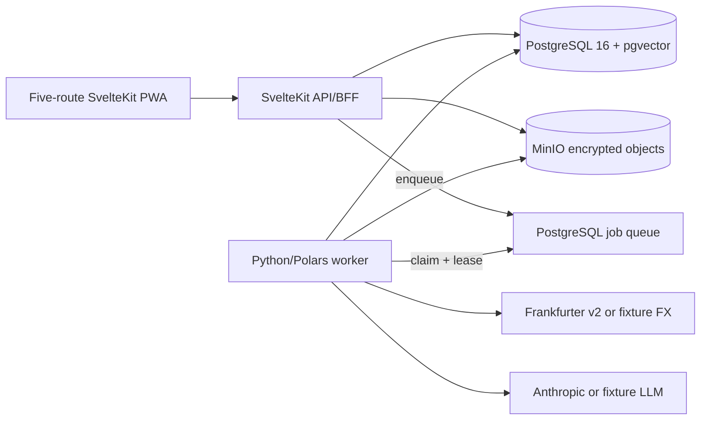

# Ledger Phase 1 — Codebase Handoff

**Snapshot:** 2026-07-24

**Current phase:** Phase 1

**Phase status:** `in_review`

This handoff describes the Phase 1 implementation currently in the working
tree. It is an implementation map, not an acceptance report: the final
`make test`, `make check`, and fresh-stack `make smoke` gates still need to be
run before the phase can move to `in_review`.

## Read These First

1. [PROJECT_CONTEXT.md](PROJECT_CONTEXT.md) — active scope and phase metadata.
2. [PHASE-1-BUILD-PLAN.md](PHASE-1-BUILD-PLAN.md) — Phase 1 backlog and
   acceptance gates.
3. [BUILD-PLAN.md](BUILD-PLAN.md) — completed Phase 0 baseline and golden
   reconciliation contract.
4. [ARCHITECTURE.md](ARCHITECTURE.md) — current design plus explicitly labeled
   later-phase design.
5. [ADR-0001](decisions/0001-application-layer-statement-encryption.md),
   [ADR-0002](decisions/0002-accept-equivalent-amex-description-columns.md),
   [ADR-0003](decisions/0003-ai-categorization-proposals.md), and
   [ADR-0004](decisions/0004-account-positions-and-net-worth.md).
6. [CHANGELOG.md](../CHANGELOG.md) — delivered changes by phase.

`docs/` is canonical. Jira and Confluence are not configured for this project;
the local build plan is the Phase 1 backlog.

## System at a Glance



The SvelteKit process owns UI rendering, validation, HTTP contracts, encrypted
uploads, parameterized reads, and job creation. The Python worker owns parsing,
normalization, FX stamping, deterministic categorization, reconciliation,
provider-backed categorization and column mapping, and atomic base-currency
rebuilds. PostgreSQL is authoritative for ledger data, settings, cached rates,
learned mappings, review proposals, and job state.

## Repository Map

| Path | Responsibility |
|---|---|
| `apps/web/` | SvelteKit UI, API routes, PWA shell, server SQL, and browser/component tests |
| `packages/shared-types/` | Zod schemas and canonical TypeScript request/response contracts |
| `services/worker/worker/` | Python ingestion, provider integrations, service jobs, and persistence |
| `services/worker/tests/` | Worker regression tests and synthetic fixture policy |
| `db/migrations/` | Ordered schema migrations `001` through `011` |
| `db/seeds/` | Idempotent taxonomy and local development account seed |
| `scripts/phase0_smoke.py` | Golden Phase 0 `2855.59` and repeat-import flow |
| `scripts/phase1_smoke.py` | Extended synthetic OFX/FX/AI/account/base-switch flow |
| `docs/` | Source-of-truth scope, architecture, decisions, plans, and handoff |

Generated builds, dependency stores, caches, local environments, raw financial
files, and `.env` are not source artifacts.

## Local Runtime

The Compose stack has four long-running services plus one-shot migration/seed
jobs:

| Service | Role |
|---|---|
| `web` | SvelteKit UI and `/api/*` routes on port `3000` |
| `worker` | Claims and processes PostgreSQL jobs |
| `postgres` | Canonical ledger, settings, FX cache, and queue |
| `minio` | Encrypted raw-statement objects; console on port `9001` |
| `migrate` / `seed` | Apply ordered migrations and idempotent development data |

The normal interactive start is:

```sh
cp .env.example .env
make up
```

Use the stub providers for deterministic integration and smoke work:

```sh
WORKER_PROVIDER_MODE=stub docker compose up --build --detach
curl --fail --silent --show-error http://127.0.0.1:3000/api/health
```

`WORKER_PROVIDER_MODE=live` uses Frankfurter and uses Anthropic only when
`ANTHROPIC_API_KEY` is nonblank. Without that key, deterministic known-format
imports still work, unknown CSV/XLSX files settle as `needs_ai`, and existing
categorization proposals remain reviewable; new categorization jobs cannot run.

The active reporting currency comes from the singleton `ledger_settings` row.
`CAD` is seeded initially. Environment values configure providers and process
behavior; they are not a mutable replacement for the database setting.

## Five-Page Application Shell

`apps/web/src/routes/+layout.svelte` owns the persistent brand, desktop and
mobile navigation, privacy indicator, content frame, and footer. The focused
routes are:

| Route | Current responsibility |
|---|---|
| `/` | Net worth, assets/liabilities, completeness, utilization, balance/cash-flow charts, FX summary, and recent transactions |
| `/transactions` | URL-backed filters, sort, paging, native/base values, running balances, provenance, and category correction |
| `/accounts` | Asset/card sections, account and institution editing, card limits/utilization, and base-currency control |
| `/categories` | Taxonomy editing/archive, unresolved work, proposal review, and categorization retry |
| `/imports` | Account-targeted upload, job polling, history, reconciliation, failure, and `needs_ai` states |

The CSS and components preserve responsive layouts, keyboard use,
reduced-motion behavior, and installable-PWA behavior.

### Service-worker privacy boundary

`apps/web/src/service-worker.ts` caches only:

- build/static shell assets;
- the `/` navigation with a network-first shell fallback; and
- successful network-first reads for `/api/analytics/balance` and
  `/api/analytics/cashflow`.

Direct navigation to the other four pages is network-only. Net-worth responses
are never service-worker cached. The worker also does not cache transaction
pages, account lists, FX analytics, jobs or job details, uploads or other
writes, category/proposal data, or import history. API handlers also emit
`Cache-Control: no-store` read headers. Treat browser Cache Storage as private financial
data when testing or handing a device to someone else.

## HTTP API

All endpoints are under `/api`. Money and rates cross the boundary as exact
decimal strings. Validation contracts live in `packages/shared-types/src/`.

| Method and path | Contract |
|---|---|
| `GET /api/health` | PostgreSQL readiness |
| `POST /api/ingest` | Validate, encrypt, store, and enqueue one account's files |
| `GET /api/jobs` | Filtered/paginated job history |
| `GET /api/jobs/:id` | Kind-discriminated job state and result |
| `GET /api/accounts` | Native/base positions, per-card utilization, and aggregate utilization |
| `POST /api/accounts` | Create an asset or credit-card account |
| `PATCH /api/accounts/:id` | Edit mutable metadata and optional card limit |
| `GET /api/institutions` | List institutions |
| `POST /api/institutions` | Create an institution |
| `PATCH /api/institutions/:id` | Rename an institution |
| `GET /api/transactions` | URL-backed filtering, sorting, and pagination |
| `PATCH /api/transactions/:id` | Apply a transaction correction or explicit merchant/flow mapping |
| `GET /api/categories` | Taxonomy including archive/protection metadata |
| `POST /api/categories` | Create a taxonomy entry |
| `PATCH /api/categories/:id` | Rename, move, edit, or archive when allowed |
| `GET /api/categories/unresolved` | Distinct unresolved merchant/flow pairs with counts and date bounds |
| `GET /api/categories/proposals` | Filter the audited categorization review queue |
| `PATCH /api/categories/proposals/:id` | Accept or reject one pending proposal atomically |
| `POST /api/categories/categorize` | Enqueue a deduplicated manual retry/backfill |
| `GET /api/analytics/balance` | Corrected running/consolidated position series |
| `GET /api/analytics/cashflow` | Inflow/outflow/net plus neutral card-payment series, excluding transfer double counting |
| `GET /api/analytics/net-worth` | Current included/excluded account valuation and completeness |
| `GET /api/analytics/fx` | Deterministic foreign-spend market-rate and markup analysis |
| `GET /api/settings` | Active base currency |
| `POST /api/settings/base-currency` | Enqueue a deduplicated atomic rebuild job |

Important server-side files:

| File | Responsibility |
|---|---|
| `apps/web/src/lib/server/db.ts` | Pool, parameterized queries, and canonical account/transaction/analytics read builders |
| `apps/web/src/lib/server/phase1.ts` | Account mapping and deduplicated service-job enqueueing |
| `apps/web/src/lib/server/upload.ts` | Upload validation, encrypted object writes, and ingest job creation |
| `apps/web/src/lib/server/job-result.ts` | Worker snake_case to public camelCase result validation |
| `apps/web/src/lib/server/api.ts` | Consistent JSON errors and privacy headers |

`packages/shared-types/src/account.ts`, `analytics.ts`, `category.ts`,
`institution.ts`, `job.ts`, `query-spec.ts`, `settings.ts`, and `transaction.ts`
define the public TypeScript contracts. The Python Pydantic models mirror the
worker side explicitly; they are not generated from TypeScript.

## Ingestion Flow

1. `POST /api/ingest` validates the account and multipart files.
2. The web process encrypts each file with the `LEDGER01` AES-256-GCM envelope
   and stores only ciphertext in MinIO.
3. One `ingest` job references the account and content-addressed object keys.
4. A lease-fenced worker claims the job and decrypts each object in memory.
5. The adapter registry evaluates OFX/QFX, Amex XLSX, generic CSV, then
   deterministic PDF tables.
6. An unsupported CSV/XLSX may enter the AI column-mapping path. Unsupported
   or irregular PDF remains deterministic `needs_ai`; Phase 1 never sends PDF
   content to a model.
7. Parsed rows are normalized with account-kind-aware signs, dated FX rates,
   deterministic categories, merchant identities, and stable dedup hashes.
8. The worker reconciles opening balance plus native movement against closing
   balance, then persists the statement and transactions atomically.
9. After financial persistence succeeds, novel unresolved merchant/flow pairs
   and missing FX work can be enqueued separately. A provider failure cannot
   roll back the reconciled import.
10. The browser polls the job API and refreshes the affected views.

### Supported format behavior

- **Amex XLSX:** recognizes the transaction/summary export and the equivalent
  Description/Merchant aliases governed by ADR-0002.
- **Generic CSV:** deterministic known headers, explicit date/decimal/sign
  handling, and fail-closed ambiguity.
- **Unknown CSV/XLSX:** sends headers plus at most five structurally redacted
  sample rows to the capable-model mapping provider. It validates the column
  map, date and decimal formats, amount versus debit/credit exclusivity,
  currency, sign convention, parsed row types, account compatibility, and
  reconciliation before storing the adapter fingerprint. Invalid output writes
  no financial rows and remains `needs_ai`.
- **OFX/QFX:** supports OFX1 SGML and OFX2 XML bank/card statements. It requires
  FITID, validates statement currency and masked account identity, and rejects
  investment statements. Migration `009` makes `(account_id, FITID)` unique for
  rows marked with `ofx_transaction_type` enrichment.
- **PDF:** deterministic table extraction only. Missing or rejected tables
  return `needs_ai`; irregular-PDF AI/OCR remains Phase 4.

## Worker Modules and Providers

| Module | Responsibility |
|---|---|
| `worker/main.py` | Environment validation, live/stub provider wiring, and worker loop |
| `worker/pipeline.py` | Per-file ingestion and the four-kind job runner |
| `worker/repository.py` | PostgreSQL leases, persistence, mappings, proposals, rates, and rebuild operations |
| `worker/storage.py` | S3/MinIO access and `LEDGER01` envelope decryption |
| `worker/models.py` | Canonical Pydantic input/output models |
| `worker/money.py` | Exact decimal normalization and quantization |
| `worker/dedup.py` | Stable transaction hashes |
| `worker/reconcile.py` | Exact native-currency reconciliation and coverage gaps |
| `worker/categorize.py` | Account-kind-aware deterministic rules and flow classification |
| `worker/ai_categorization.py` | Minimized batching, structured validation, thresholding, mapping, and proposals |
| `worker/column_mapping.py` | Redacted unknown-tabular mapping, validation, and learned adapter persistence |
| `worker/fx.py` | Frankfurter/cache/fixture providers, refresh, and atomic base rebuild |
| `worker/adapters/ofx.py` | OFX1/OFX2 bank/card parsing and FITID extraction |
| `worker/llm/anthropic.py` | Anthropic structured-output implementation |
| `worker/llm/fixture.py` | Deterministic CI/smoke LLM implementation |
| `worker/llm/provider.py` | Provider protocol and disabled-provider behavior |

Live defaults are pinned through `.env.example`: Haiku 4.5 for categorization
and Sonnet 5 for column mapping. Provider output still passes refusal,
truncation, schema, allowed-ID, flow/category compatibility, and business-rule
checks after structural parsing.

The Frankfurter provider records the returned rate, source, and actual rate
date. Only a rate on or before the requested date and no more than seven days
old is usable. Worker and web reads share the validated
`FX_MAX_STALENESS_DAYS` setting; startup rejects values outside `0..7`. CAD
identity rates and historical/current USD/TZS conversions use the same cache
interface; CI and smoke use fixture providers.

## Discriminated Jobs

The `job.kind` discriminator is one of:

| Kind | Purpose | Result shape |
|---|---|---|
| `ingest` | Parse, persist, and reconcile uploaded files | Added/skipped totals and per-file outcome |
| `categorize` | Resolve distinct unknown merchant/flow pairs | Scanned, auto-applied, proposed, unchanged |
| `fx_refresh` | Fetch and persist required dated rates | Base, quotes, and rates stored |
| `base_currency_rebuild` | Prefetch, lock, rebuild, and switch base | Previous/target base, row count, setting result |

Active `(kind, deduplication_key)` values are unique. The worker uses claim
tokens, heartbeats, stale-claim recovery, and fencing so an expired worker
cannot write a terminal result after a newer claimant owns the job. Provider and
service failures have three bounded retries beyond the initial attempt; invalid
payloads and deterministic ingest failures fail closed.

Migration `007` queues the one-time Phase 1 automatic categorization backfill
only when fallback merchant transactions exist. Later imports enqueue only
novel unresolved merchant/flow work. Repeated or concurrent service requests
reuse the active deduplication key.

## Database Schema and Migrations

The Phase 1 schema has 12 application tables:

`institution`, `account`, `category`, `merchant`, `statement`, `txn`, `job`,
`adapter`, `fx_rate`, `ledger_settings`, `merchant_category_mapping`, and
`categorization_proposal`.

| Migration | Purpose |
|---|---|
| `001_enable_extensions` | Enable UUID/crypto and pgvector support |
| `002_create_reference_data` | Institutions, accounts, categories, and merchants |
| `003_create_ledger` | Statements and canonical transactions |
| `004_create_ingestion` | Jobs, adapters, and FX-rate cache |
| `005_add_ingestion_safety` | Source-file uniqueness plus job claim tokens/stale-lease indexes |
| `006_add_phase1_foundations` | Credit limits; immutable account identity; ledger settings; category archive/protection; provenance; merchant mappings; proposals; discriminated/deduplicated jobs and retries |
| `007_enqueue_phase1_categorization_backfill` | Conditional one-time unresolved-merchant backfill |
| `008_correct_fallback_category_confidence` | Normalize fallback confidence to zero |
| `009_enforce_ofx_fitid_identity` | OFX-only `(account_id, external_ref/FITID)` uniqueness |
| `010_guard_referenced_category_kind` | Prevent kind changes once a category is referenced by transactions, mappings, proposals, or child categories |
| `011_tighten_masked_account_references` | Reject full/formatted identifiers and allow only a non-digit masked label plus a 2–6 digit suffix |

Migrations are ordered, forward-applied SQL. Never edit an already-applied
migration to change production behavior; add the next migration.

## Financial Invariants

- Monetary values and rates are fixed-precision database/Python decimals and
  exact decimal strings at HTTP boundaries. JavaScript and LLM arithmetic is
  never authoritative.
- Native amount and currency are immutable truth. Base amounts, rates, and rate
  dates are derived and rebuildable.
- Credit-card charges/fees are positive; payments, credits, and refunds are
  negative. Asset-account flows are categorized with asset semantics.
- Statement reconciliation remains
  `opening_balance + sum(amount_native) = closing_balance`; the golden closing
  balance is `2855.59`.
- `dedup_hash` prevents repeat/overlap double counting. OFX also uses FITID as
  authoritative account-scoped external identity.
- Account kind and native currency cannot change after the account has a
  statement or transaction. Phase 1 exposes no account deletion.
- A non-null source-reported opening/closing balance may anchor a position when
  status is `ok`, `gap`, or `pending`. Here `pending` means the statement is
  one-sided (common in OFX) and cannot be arithmetically verified; it is reported
  evidence, not an `ok` reconciliation. `mismatch` invalidates the reported
  anchor and is excluded.
- `credit_limit` is nullable, positive, card-only, and native-currency
  metadata. It never contributes to net worth.
- Card usage is `max(currentBalance, 0)`, available credit is
  `limit - currentBalance`, and utilization is usage divided by limit. Values
  are not clamped; missing limits or verified balances omit utilization.
- Net-worth contribution is an asset-account balance or the negated card
  balance at a current cached rate. Missing verified balances or usable rates
  are excluded and make the response `partial` with per-account reasons.
- Cash flow excludes transfer/payment double counting. FX fee/markup appears
  only where both foreign-spend evidence and a usable market rate exist.
- Transaction list running balances are calculated for every stable ordered row
  in native and, where possible, base currency; rows on the same date do not
  share an end-of-day balance.
- A base-currency change prefetches all required history, acquires the ledger
  valuation lock, rebuilds derived values in one transaction, and changes the
  singleton setting last. A missing rate leaves the old base untouched.

## Categorization Precedence and Privacy

Transaction provenance is one of `fallback`, `rule`, `ai`, `user_merchant`, or
`user_transaction`. Resolution precedence is:

1. transaction-specific user correction;
2. user merchant-and-flow mapping;
3. accepted learned AI merchant-and-flow mapping;
4. account-kind-aware deterministic rule;
5. protected `Other` fallback.

Categorization batches contain only an opaque key, normalized merchant text,
coarse flow type, and allowed taxonomy. They contain no amounts, dates,
balances, account identifiers, transaction identifiers, or statement content.
Existing categories at confidence `>= 0.85` can auto-apply. Lower-confidence
assignments and every new-category proposal remain audited pending review.
Provider output never enters the repository's category auto-create-by-name path.

The default manual edit affects one transaction. `applyToMerchant: true` is the
explicit choice to update matching current transactions and learn that
merchant/flow mapping for future imports. Neither an AI retry nor a backfill may
replace `user_transaction` or `user_merchant` provenance.

Raw uploads are encrypted before MinIO with a versioned AES-256-GCM envelope.
Only masked account references persist. MinIO uses a non-root bucket-scoped app
credential. Authentication, multi-tenancy, and row-level tenant isolation are
not Phase 1 features, so the local stack must not be exposed as if it were an
authenticated production service.

## Tests and Acceptance Commands

Local quality work needs Node.js 22+, pnpm 11.4, uv, Python 3.12, Docker
Compose, and a Chromium runtime for Playwright. Install the browser once with:

```sh
pnpm --filter @ledger/web exec playwright install chromium
```

Run the required local gates from the repository root:

```sh
make test
make check
```

`make test` runs shared/web TypeScript tests, Svelte component tests, browser
tests, and Python pytest through the workspace scripts. `make check` runs
TypeScript/Svelte checks plus Ruff and strict mypy, including both smoke scripts
in Ruff's target set.

Run the extended smoke flow only against a disposable, healthy fresh stack:

```sh
cp .env.example .env
WORKER_PROVIDER_MODE=stub docker compose up --build --detach
docker compose ps --all
curl --fail --silent --show-error http://127.0.0.1:3000/api/health
make smoke
```

After inspecting any failure logs, remove the disposable stack with:

```sh
docker compose down --volumes --remove-orphans
```

`--volumes` deletes that Compose project's database and object-store volumes;
do not use it against an environment whose data must be retained.

The intended Phase 1 smoke contract includes the Phase 0 `2855.59` result,
zero-row repeat import, synthetic OFX1/OFX2 bank/card USD/TZS statements,
stubbed categorization, account/card utilization, partial/complete net worth,
FX-fee analysis, and an atomic base-currency switch without mixed-base reads.
This document does not claim those final gates have passed.

CI is configured to run TypeScript/check/browser tests, Python pytest/Ruff/mypy,
idempotent migrations and seeds with Phase 1 schema assertions, then the
stub-provider container smoke job. Treat CI configuration as a gate definition,
not evidence of the current working tree's result.

## Fixture Status

All checked-in worker fixtures are synthetic and nonprivate. XLSX test files are
generated in memory, the smoke scripts generate sanitized statement payloads,
and `WORKER_PROVIDER_MODE=stub` supplies deterministic AI and FX results.

The original private Amex exports used during Phase 0 acceptance are not
checked in. Sanitized institution-specific TZS/USD exports have not yet been
supplied or accepted. Synthetic fixtures cover OFX protocol behavior,
multi-currency math, retries, privacy validation, and failure paths, but they do
not prove compatibility with a particular institution's CSV/XLSX export.
Institution-specific acceptance remains a Phase 1 handoff item when those
sanitized files become available.

## Common Extension and Debug Paths

- Add a deterministic statement format under `worker/adapters/`, register it
  in `worker/adapters/__init__.py`, and add sanitized success, ambiguity,
  reconciliation, and repeat-import tests.
- Change a public payload in `packages/shared-types` first, then update the API,
  UI consumer, Python mirror if applicable, and contract tests together.
- Change financial behavior with a migration where state is involved and add a
  regression that asserts exact decimal results and polarity.
- Inspect `docker compose ps --all`, `docker compose logs --tail=200 web worker`,
  the `job` row, and per-file job result before changing retry behavior.
- A `needs_ai` import is a completed fail-closed outcome, not a partially
  persisted statement. A `failed` service job after retry exhaustion should
  leave previously reconciled financial rows intact.
- If readers show mixed currencies, inspect `ledger_settings`, transaction base
  currencies, the active `base_currency_rebuild` job, and the valuation-lock
  path before attempting any repair.

## Phase 1 Review Evidence

- `make test` passes the shared-contract, web unit/component, Playwright, and
  worker suites.
- `make check` passes TypeScript/Svelte checks plus Ruff and strict mypy.
- The production web build and a clean 11-migration plus seed run pass.
- A disposable fresh stack passes the stub-provider Phase 1 smoke, including
  the permanent `2855.59` and repeat-import gates.
- All five direct routes and mobile navigation pass browser coverage.
- Sanitized user-supplied TZS/USD institution exports remain a review input when
  available; synthetic protocol and failure fixtures are already green.

After significant documentation changes, sync `docs/` to Confluence when a
space is configured. It is currently unconfigured, so no publication step can
be performed yet.
